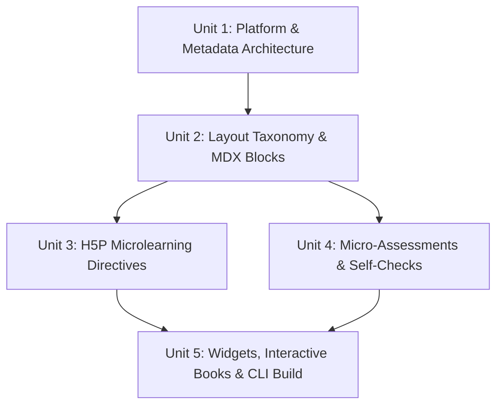

# Course Buddy Instance: Introduction to Srujana-Bodh
> **Subtitle**: A platform for REVA faculty to create a course and deliver it using AI features
> **File**: `intro-srujana-bodh.md`

---

## Section 1 — Course Metadata

| Field | Value |
|-------|-------|
| Course code | `SB-101` |
| Course name | `Introduction to Srujana-Bodh` |
| Subtitle | `A platform for REVA faculty to create a course and deliver it using AI features` |
| Short name | `intro-srujana-bodh` |
| Stream | `Faculty Development / Pedagogical AI` |
| Semester | `FDP / Professional Certification` |
| Instructor | `REVA AI Learning Hub / Srujana-Bodh Core Team` |

**Supplemental context**: Load `knowledge/SB-101-intro-srujana-bodh/wiki/index.md` at the start of every session for this course.

---

## Section 2 — Textbooks and References

1. **Interactive Presentation Specification (IPS v1.0)** — `d:\Github\REVA-learning-hub\tools\presentation-creator\specification.md`
2. **Microlearning Input Authoring Guide** — `d:\Github\REVA-learning-hub\tools\presentation-creator\input-template.md`
3. **Srujana-Bodh Presentation Creator CLI & Converter** — `d:\Github\REVA-learning-hub\tools\presentation-creator\convert.py`
4. **REVA Human Advantage Framework (RHAF)** — Outcome-Based Education & Microlearning Guidelines.

---

## Section 3 — Syllabus Outcomes & Unit Breakdown

### Course Outcomes (COs):
* **CO-1**: Configure global presentation frontmatter, metadata, branding, and AI tutor linkages (`aiTutorUrl`, `aiVivaUrl`).
* **CO-2**: Apply microlearning layout strategies, structural slide components, metric cards, and standard MDX semantic callouts.
* **CO-3**: Design interactive microlearning experiences using H5P markdown directives (accordions, tabs, flashcards, timelines, hotspots, before/after comparisons).
* **CO-4**: Embed formative assessments and self-checks (MCQ, True/False, Fill-in-the-blanks, Matching, Sortable sequences, Quiz groups).
* **CO-5**: Orchestrate interactive MDX React widgets, multi-chapter Interactive Books, and execute build pipelines (`convert.py`) for static HTML & LMS deployment.

---

### Unit 1: Platform Foundation & Global Metadata Architecture
*Focus: Document Structure, Presentation Frontmatter & AI Integration*

* **1.1 Overview of Srujana-Bodh Presentation Creator**: Hybrid Markdown authoring architecture, MDAST/HAST compilation pipeline, React rendering engine.
* **1.2 Global YAML Frontmatter**: Setting `specVersion`, `title`, `subtitle`, `author`, `affiliation`, `theme`, `aspectRatio`, and `audience`.
* **1.3 AI Assistant Linkages**: Embedding `aiTutorUrl` (Gemini Gem / Custom AI Tutor) and `aiVivaUrl` (Interactive Assessment Bot) in global frontmatter.
* **1.4 Categorization & Objectives**: Defining learning objectives list, tags, description, and versioning control.

---

### Unit 2: Slide Layout Taxonomy & Semantic Content Blocks
*Focus: Structural Layouts, MDX Elements & Visual Media*

* **2.1 Slide Separation & Local Frontmatter**: Using `---` slide dividers, configuring local slide metadata (`slideId`, `layout`, `purpose`, `duration`, `importance`).
* **2.2 Basic & Structural Layout Vocabulary**:
  * Basic: `hero`, `title`, `section`, `agenda`, `content`, `summary`, `thankyou`.
  * Structural: `single-column`, `two-column`, `three-column`, `content-image`, `image-content`, `comparison`, `process`, `timeline`, `roadmap`, `quote`, `story`.
* **2.3 Data & Academic Layout Vocabulary**:
  * Data/Strategy: `table`, `metrics`, `kpi-dashboard`, `chart`, `chart-insights`, `heatmap`, `swot`, `pestle`, `strategy-map`, `risk-matrix`.
  * Academic: `concept`, `definition`, `case-study`, `research-paper`, `methodology`, `results`, `references`.
* **2.4 Semantic MDX Blocks & Admonitions**: `<Metric />` cards, insight blockquotes (`> 💡`), and Docusaurus admonition containers (`:::success`, `:::tip`, `:::warning`, `:::danger`, `:::note`).
* **2.5 Custom Charts & Visual Media Integration**: `<Chart />` components, markdown images, HTML5 video embeds (`<video src="..." />`), and image captions.

---

### Unit 3: Interactive H5P Microlearning Directives
*Focus: Rich Interactivity & Learner Engagement*

* **3.1 Information Chunking Directives**:
  * Accordion: `:::accordion` syntax for collapsible topic exploration.
  * Tabs: `:::tabs` syntax (`=== Category Name`) for tabbed content browsing.
  * Cards Grid: `:::cards` syntax (`Card: Title`) for modular concept cards.
* **3.2 Memory & Recall Micro-activities**:
  * Flashcards: `:::flashcards` (`Q:` / `A:`) for retrieval practice.
  * Timeline: `:::timeline` (vertical/horizontal orientation, temporal milestones).
* **3.3 Visual & Comparative Directives**:
  * Image Hotspots: `:::hotspots` (`(x,y)` coordinates with title and description tooltips).
  * Before/After Comparison: `:::compare` (interactive slider comparing dual visual states).

---

### Unit 4: Formative Micro-Assessments & Self-Check Directives
*Focus: AI-Ready Assessment & Active Evaluation*

* **4.1 Multiple Choice & Binary Checks**:
  * MCQ Directive: `:::mcq` with `[x]` correct option, `[ ]` distractors, and explanation feedback.
  * True/False Directive: `:::truefalse` (`answer: true/false`) with contextual explanations.
* **4.2 Textual & Relational Assessments**:
  * Fill in the Blanks: Paragraph inline blanks `[[correct_answer]]` and alternate answers `[[option1|option2]]`.
  * Matching Activity: `:::matching` key-value pairs (`Term => Definition`).
  * Sortable Sequence: `:::sequence` ordered steps for process validation.
* **4.3 Integrated Assessment Bundles**:
  * Quiz Group Directive: `:::quiz` encapsulating multi-question formative tests within slides.

---

### Unit 5: React MDX Widgets, Interactive Books & Deployment Pipeline
*Focus: Advanced Components, Interactive Books & Production Build*

* **5.1 Custom React Widgets**: Integrating dynamic widgets (`<ROIWidget />`, `<EnrollmentCalculator />`, `<AskAI />`) into markdown slides.
* **5.2 Interactive Multi-Chapter Books**: Organizing comprehensive course content into interactive books using the `---chapter---` divider.
* **5.3 Command Line Conversion (`convert.py`)**:
  * Running the CLI build command: `python tools/presentation-creator/convert.py <input-file.md>`.
  * Parsing markdown AST, compiling presentation-data JSON, and building static HTML assets.
* **5.4 Delivery & LMS Integration**: Exporting single-page HTML presentations, SCORM/xAPI packages, and sharing interactive web decks with REVA faculty and students.

---

## Section 4 — Concept Dependency Map

---

## Section 5 — Assessment Blueprint

| Component | Weight | Coverage |
|-----------|--------|----------|
| **Formative Micro-Quizzes (H5P Directives)** | 20% | Units 1, 2 |
| **Interactive Slide Deck Creation Lab** | 30% | Units 2, 3, 4 |
| **Full Course Interactive Book & MDX Widget Project** | 30% | Units 1, 2, 3, 4, 5 |
| **Srujana-Bodh CLI Deployment & Peer Review** | 20% | Unit 5 |

---

## Section 6 — Mastery Tracker

*Update after each session. Target: all concepts at level 6 by course completion.*

| Concept | Current level | Last evidence | Next practice |
|---------|--------------|---------------|---------------|
| Global Frontmatter & AI Tutor Linkage | 1 — Not started | | |
| Layout Selection & Slide Frontmatter | 1 — Not started | | |
| MDX Semantic Callouts & Metric Cards | 1 — Not started | | |
| Interactive H5P Accordion, Tabs & Cards | 1 — Not started | | |
| Flashcards, Timelines & Hotspot Diagrams | 1 — Not started | | |
| Formative Micro-Quizzes (MCQ, Fill-in-Blanks) | 1 — Not started | | |
| Interactive Books (`---chapter---`) | 1 — Not started | | |
| CLI Conversion & HTML Build (`convert.py`) | 1 — Not started | | |

**Mastery levels:**
1. Not started
2. Basic recall
3. Conceptual understanding
4. Application
5. Analysis and integration
6. Exam-ready mastery

---

## Section 7 — Socratic Session Protocol

Apply this sequence for every concept discussion:

1. **Probe first** — "Before I explain, what do you already know about `{{concept}}`?"
2. **Diagnose** — identify whether the gap is factual, conceptual, or application.
3. **Explain** — adapt level to the learner's current mastery (levels 1–6):
   - Level 1–2: analogy and plain language; no code/markdown syntax yet.
   - Level 3–4: formal syntax definition, worked slide example, H5P directive structure.
   - Level 5–6: complex layout composition, MDX widget integration, CLI build debugging.
4. **Sequence**: What → Why → How → What If
5. **Close** — "Explain this back to me in one sentence." Then: one practical slide exercise.
6. **Update mastery tracker** after each session.

---

## Section 8 — Integrity Guardrail (AI Use)

Apply the REVA sequence: **Attempt → Assist → Augment → Automate**

- Faculty/learner must draft the slide structure before receiving AI enhancements.
- AI assists with Markdown formatting, layout selection, and quiz prompt refinement — not raw content invention.
- AI augments visual aesthetics, interactive widget configuration, and metadata completeness.
- AI automates final CLI compilation (`convert.py`) once the microlearning course content is validated.

Mandatory explain-back prompt after any AI-assisted session:  
*"What did you understand today about `{{concept}}` — how does it enhance student engagement in Srujana-Bodh?"*

---

## Section 9 — Session Close

End every session with:
1. **Learner summary** — learner explains the session concept in their own words.
2. **One practice slide exercise** — learner commits to authoring one interactive slide before next session.
3. **One checkpoint date** — when will they review the mastery tracker entry?

---

## Section 10 — Evidence and Portfolio

After reaching mastery level 4+ on a concept, prompt:

> "This interactive slide deck can become Srujana Stage 2 evidence.  
> Have you compiled your course deck using `convert.py`?  
> Have you verified the interactive H5P self-checks in a browser?  
> Is it documented in your faculty portfolio?"
