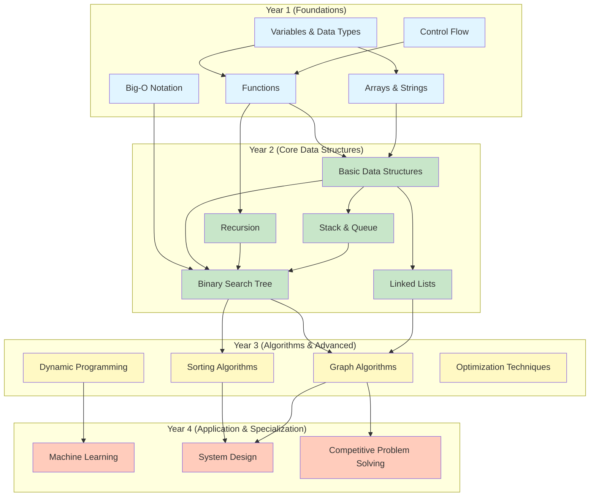

# /concept-map-network
## Generate Curriculum Concept Network & Prerequisite Map

> Paste this command: `/concept-map-network <curriculum-folder-or-file>`
>
> **Purpose**: Extract all foundational concepts from a curriculum (all courses, all topics), map prerequisite chains (PUC → Year 1 → Year 2 → Year 3 → Year 4), verify no concept is isolated, and link concepts to job roles and assessments. Output as Mermaid network diagram + CSV export.
>
> **Session Type**: Curriculum coherence analysis | **Duration**: 90–120 minutes
>
> **Human Role**: You provide curriculum documents (all course syllabi, topics, CO descriptions). AI extracts concepts and generates network. Faculty reviews for coherence and validates sequencing.

---

## Input Requirements

Provide **curriculum documentation** containing:

1. **All Course Syllabi** (for entire programme, by semester)
   - Course code, title, credits
   - Unit breakdown with topics
   - Prerequisites listed
   - CO descriptions

2. **Job Role Profile Document**
   - 6–10 job roles
   - Skills / competencies per role
   - Tools/concepts used in each role

3. **Optional: GATE/Competitive Exam Syllabi** (for CSE/ECE/Mech)
   - Topic list
   - Key concepts emphasized

---

## Concept Extraction & Network Mapping Process

### Phase 1: Concept Extraction (AI Parses All Documents)

AI extracts **atomic concepts** from:
- **Course topics**: Keywords, technical terms, foundational principles
- **CO descriptions**: Implied concepts needed to achieve CO
- **Job role skills**: Concepts used in industry context
- **Exam syllabi**: Concepts emphasized in competitive exams

**Concept Definition**: An atomic, teachable unit of knowledge or skill that:
- Can be explained in 1–3 minutes
- Serves as building block for more complex ideas
- Is used in multiple contexts (or has defined future use)

**Example Concepts**:
- Data Structures: Binary Search Tree, Hash Table, Graph Traversal, Stack, Queue
- Calculus: Limits, Derivatives, Integrals, Partial Derivatives, Taylor Series
- Physics: Ohm's Law, Faraday's Law, Newton's Laws, Circuit Analysis
- Ethics: Informed Consent, Privacy, Bias, Stakeholder Analysis, Ethical Reasoning

**Output of Phase 1**: Concept list (100–300 concepts depending on programme breadth)

---

### Phase 2: Prerequisite Chain Mapping

For each concept, identify:

| Attribute | Definition | Source |
|---|---|---|
| **Prerequisite(s)** | Concept(s) that must be taught/learned before this concept | Prior course syllabus; logical dependency |
| **Prerequisite Source** | Where prerequisite is taught: PUC syllabus, Year 1, Year 2, etc. | Curriculum map; expert judgment |
| **Courses Teaching** | Which course(s) teach this concept? (Sem 1, Sem 3, Sem 7) | Course syllabi |
| **Bloom's Level** | At what Bloom's level is it taught? (L1, L2, L3, L4, L5, L6) | CO descriptions; activity analysis |
| **Future Usage** | Which downstream course(s) use this concept? | Future course prerequisites; CO descriptions |
| **Job Role Usage** | Which job roles require this concept? | Job role profiles |
| **GATE/Exam Relevance** | Is this concept on GATE, JEE, UPSC, etc.? | Exam syllabi |

**Mapping Table Example** (CSV format):

```
Concept,Prerequisite_Concept,Prerequisite_Source,Courses_Teaching,Bloom_L,Future_Courses,Job_Roles_Using,GATE_Relevance
Binary Search Tree,"Basic Data Structures, Recursion, Big-O Notation",SEM2,DSA (SEM2) [L3]; Algorithms (SEM3) [L4],L3→L4,"Advanced Algorithms (SEM3), Database Design (SEM5), Big Data (SEM7)","Software Engineer, ML Engineer, Systems Engineer",Yes
Hash Table,"Arrays, Linked Lists, Hash Function Basics",SEM2,DSA (SEM2) [L3]; Databases (SEM4) [L4],L3→L4,"Database Design (SEM5), Distributed Systems (SEM6)","Backend Engineer, Database Administrator, ML Engineer",Yes
Recursion,"Iteration, Function Calls, Call Stack",SEM1,Programming 1 (SEM1) [L2]; Programming 2 (SEM2) [L3],L2→L3,"All higher CS courses (SEM3+)","All Software Roles",Yes
Object-Oriented Programming,"Variables, Functions, Scope",SEM2,Programming 2 (SEM2) [L3]; Software Engineering (SEM4) [L4],L3→L4,"All project-based courses (SEM3+)","All Software Roles",Partial
Limits & Continuity,"Algebra, Functions, Sequences",PUC,"Calculus 1 (SEM1) [L2]; Real Analysis (SEM3) [L4]",L2→L4,"Calculus 2 (SEM2), Real Analysis (SEM3), Optimization (SEM4)","All Engineering Roles",Yes
```

---

### Phase 3: Network Coherence Analysis

AI audits the concept network for:

#### Check 3.1: Isolated Concepts (No Prerequisites, No Future Use)
**Flag**: Concept with no identified prerequisite AND no identified downstream usage/job role
**Action**: Flag for faculty review — decide if concept should be removed or if gap needs filling

**Example**:
- Concept: "Bubble Sort Algorithm"
- Prerequisites: ✓ (Sorting, Arrays — both taught in SEM1)
- Future Usage: ✗ (Not used in any downstream course; not mentioned in job roles)
- GATE Relevance: No
- **Verdict**: Teach at L2-L3 for completeness, but not emphasized; lower assessment weight

#### Check 3.2: Orphaned Prerequisites (Taught, But Not Used)
**Flag**: Concept taught in early semester but has no downstream course using it
**Action**: Either remove or link to a future course; or justify why it's foundational knowledge

**Example**:
- Concept: "Number Theory: Modular Arithmetic"
- Taught: Discrete Math (SEM2) [L2]
- Future Usage in Core Courses: None
- Job Role Usage: Cryptography Engineer (niche)
- GATE Relevance: Yes (important for competitive exams)
- **Verdict**: Keep; lower course weight but maintain for GATE prep and elective linkage

#### Check 3.3: Circular Dependencies (Concept A → B → A)
**Flag**: Concept A lists Concept B as prerequisite, but Concept B is taught after A
**Action**: Resolve sequencing; move prerequisite earlier or adjust dependency

**Example**:
- Matrix Multiplication taught in SEM2
- Lists "System of Linear Equations" as prerequisite
- But System of Linear Equations taught in SEM3
- **Resolution**: Move System of Equations to SEM1/SEM2, or relax dependency (students learn it just-in-time in SEM2)

#### Check 3.4: Concept Gaps (Job Role Skill Not Covered)
**Flag**: Job role requires a skill/concept not appearing in any course
**Action**: Recommend course addition or elective creation

**Example**:
- Job Role: "Cloud Architect"
- Required Skills: Containerization, Kubernetes, Microservices, DevOps, Infrastructure-as-Code
- Curriculum Check: Microservices ✓ (SEM5), Kubernetes ✗, DevOps ✗ (only brief mention in SE), IaC ✗
- **Recommendation**: Propose "Cloud Computing" or "DevOps" elective to cover gaps

---

### Phase 4: Bloom's Progression Tracking

For concepts taught across multiple semesters, verify **progression**:

**Concept Example: Recursion**
| Semester | Course | Bloom's L | Focus | Assessment |
|---|---|---|---|---|
| SEM1 | Programming 1 | L2 (Understand) | What is recursion? Base case, recursive case | Simple factorial, Fibonacci |
| SEM2 | Programming 2 | L3 (Apply) | How to write recursive functions efficiently | Linked list traversal, tree traversal |
| SEM3 | Algorithms | L4 (Analyze) | Recursive algorithm complexity; when to use recursion vs. iteration | Merge sort, QuickSort, Divide-Conquer analysis |
| SEM5 | Advanced Algorithms | L5-L6 (Evaluate/Create) | Design novel recursive algorithms for optimization problems | Research problem: dynamic programming |

**Progression Indicator**: ✓ PASS — Recursion builds from foundational understanding to creative application

---

## Output Format 1: Mermaid Network Diagram

AI generates a Mermaid graph showing concept prerequisites and usage:



**Mermaid Features**:
- Nodes grouped by year/semester
- Edges show prerequisite relationships
- Color-coded by year/difficulty
- Shows concept flow from foundational to advanced

---

## Output Format 2: CSV Matrix Export

**Columns**:
- Concept
- Prerequisite_Concept(s)
- Prerequisite_Source (PUC / SEM 1 / SEM 2 / etc.)
- Courses_Teaching (with Semester, Bloom's L)
- Bloom_Level_Progression (L1 → L2 → ... → L6 if taught across semesters)
- Future_Courses_Using
- Job_Roles_Using
- GATE_or_Exam_Relevant
- Status (OK / FLAG_ISOLATED / FLAG_ORPHANED / FLAG_MISSING / ACTION_NEEDED)

**Usage**: Import into spreadsheet for sorting, filtering, department-wide review

---

## Output Format 3: Faculty Review Dashboard (Markdown)

```markdown
# Curriculum Concept Map Audit Report

**Programme**: [NAME]  
**Academic Year**: [YEAR]  
**Audit Date**: [DATE]

## EXECUTIVE SUMMARY

| Metric | Value | Standard | Status |
|---|---|---|---|
| Total Concepts Identified | 145 | [Domain typical: 120–200] | ✓ |
| Concepts with Clear Prerequisites | 142 / 145 | ≥90% | ✓ |
| Concepts with Future Usage Mapped | 138 / 145 | ≥90% | ✓ |
| Isolated Concepts (No Prerequisite, No Usage) | 3 | <5 | ⚠️ CONDITIONAL |
| Orphaned Prerequisites (Taught, Not Used) | 2 | <5 | ⚠️ CONDITIONAL |
| Circular Dependencies Found | 0 | 0 | ✓ |
| Job Role Coverage | 95% | ≥90% | ✓ |
| GATE/Exam Alignment (CSE/ECE) | 87% | ≥80% | ✓ |
| Bloom's Progression (Concepts with L1→L4+ progression) | 68 / 145 | ≥40% | ✓ |

**Overall Verdict**: ✓ PASS with MINOR ACTIONS

---

## DETAILED FINDINGS

### 1. ISOLATED CONCEPTS (No Prerequisites, No Future Use)

| Concept | Taught In | Bloom's L | Why Isolated? | Recommendation |
|---|---|---|---|---|
| Bubble Sort Algorithm | DSA (SEM2) | L2 | Simple sorting; not used in advanced algorithms; other sorts preferred | Keep for completeness; lower weight (5% of assessment). Emphasize comparison-based sorting principles instead. |
| Queue Data Structure | DSA (SEM2) | L2 | Basic implementation; BFS is covered in Algorithms, but Queue as standalone not emphasized | Link to BFS in Algorithms (SEM3). Revise DSA CO to emphasize Queue's role in BFS. |
| [Continue...] | | | | |

**Action**: Faculty to review "Why Isolated?" column. Decide: keep with lower weight, remove, or link to future course.

---

### 2. ORPHANED PREREQUISITES (Taught, But Not Used Downstream)

| Concept | Taught In | Bloom's L | Job Role Usage? | GATE/Exam? | Recommendation |
|---|---|---|---|---|---|
| Modular Arithmetic | Discrete Math (SEM2) | L2 | Cryptography Engineer (specialized) | Yes (GATE) | Keep for exam prep and specialized electives. Not core CS. |
| Set Theory | Discrete Math (SEM2) | L2 | All roles (foundational) | Yes | Integrate into foundational CS concepts. Link to later courses (Databases uses relational algebra). |

**Action**: Faculty to assess retention value vs. course load. Keep? Link to future course? Or move to PUC prerequisites?

---

### 3. CONCEPT GAPS (Job Roles Not Fully Covered)

| Job Role | Required Skills | Covered Concepts | Gap Concepts | Recommendation |
|---|---|---|---|---|
| Cloud Architect | AWS, Kubernetes, Microservices, DevOps, Infrastructure-as-Code | Microservices (SEM5), REST APIs (SEM4) | Kubernetes, DevOps Tooling, IaC (Terraform, CloudFormation) | Propose "Cloud Computing Specialization" elective (SEM6-7) covering Kubernetes, Docker, CI/CD, IaC, AWS. |
| ML Engineer | Linear Algebra, Probability, Statistical Learning, Deep Learning, Feature Engineering | Linear Algebra (SEM1), Probability (SEM3), Machine Learning (SEM5) | Advanced DL (Transformers, etc.), MLOps, Feature Stores | Recommend elective "Advanced ML" (SEM7) or industry partnership for capstone project. |
| Cybersecurity Analyst | Network Security, Cryptography, Penetration Testing, Compliance, Threat Analysis | Basic Network Security (SEM4) | Cryptography depth, Penetration Testing, Threat Modeling, Compliance frameworks | Propose "Cybersecurity" elective; partner with industry for labs. |

**Action**: Identify 2–3 highest-priority gaps. Plan electives or industry partnerships to close gaps.

---

### 4. BLOOM'S PROGRESSION ANALYSIS

**Concepts with Strong L1→L5+ Progression** (showing educational depth):

| Concept | SEM1 (L#) | SEM2 (L#) | SEM3 (L#) | SEM4 (L#) | SEM5+ (L#) | Progression Quality |
|---|---|---|---|---|---|---|
| Recursion | L2 | L3 | L4 | — | L5 (in ML/Algorithms electives) | ✓ STRONG |
| Algorithm Analysis | — | L2 | L4 | L5 | L6 | ✓ STRONG |
| Design Patterns | — | — | L2 | L4 | L5 | ✓ STRONG |
| Object-Oriented Principles | L2 (basic) | L3 (classes/objects) | L4 (design) | L5 (patterns) | — | ✓ STRONG |

**Concepts with Flat Progression** (taught at same level across semesters — may indicate repetition or missed opportunity):

| Concept | SEM1 (L#) | SEM2 (L#) | SEM3 (L#) | Issue | Recommendation |
|---|---|---|---|---|---|
| Sorting | L2 | L2 | L3 | Stays at L2-L3; not advancing to analysis/design | Advance SEM3 to L4-L5: students design hybrid sorts, compare complexity trade-offs, optimize for real datasets |
| Database Queries | L2 (basic SQL) | L2 (more SQL) | — | SQL remains at L2; no advancement to query optimization, design | Add SEM4: Query Optimization (L4), Database Design Patterns (L4-L5) |

---

### 5. PREREQUISITE CHAIN VALIDATION

Sample prerequisite chains verified:

✓ **Chain 1**: Variables (SEM1) → Functions (SEM1) → Recursion (SEM2) → Advanced Algorithms (SEM3) → Dynamic Programming (SEM4)
   - All prerequisites present in curriculum ✓

✓ **Chain 2**: Linear Algebra (SEM1) → Probability (SEM3) → Statistical Learning (SEM4) → Machine Learning (SEM5)
   - All prerequisites present ✓

⚠️ **Chain 3**: Basic Networking (SEM3) → **[GAP: Network Protocols missing]** → Advanced Networking (SEM5) → Cybersecurity (elective)
   - **Action**: Insert "Network Protocols Deep Dive" into SEM3 or SEM4 curriculum

---

### 6. CONCEPT-CO LINKAGE SUMMARY

| CO ID | Concepts Taught | Bloom's Coverage | Assessment Evidence | Portfolio Link |
|---|---|---|---|---|
| CO1: Apply Big-O analysis | Time Complexity, Space Complexity, Asymptotic Notation | L3-L4 | Coding assignment with complexity justification | Yes (included in algorithms project) |
| CO2: Design OOP systems | Encapsulation, Inheritance, Polymorphism, Design Patterns | L3-L4 | Design document + code review | Yes (system design capstone) |
| [Continue...] | | | | |

---

## RECOMMENDATIONS (Priority Order)

### CRITICAL (Must address before next delivery cycle):
1. [ ] Resolve orphaned concept "Modular Arithmetic": link to future course or emphasize GATE relevance
2. [ ] Gap: Kubernetes/DevOps — propose Cloud Computing elective or industry partnership

### HIGH (Address in next academic year):
1. [ ] Advance "Sorting" and "Database Queries" to L4-L5 in later semesters
2. [ ] Insert "Network Protocols Deep Dive" into SEM3-SEM4

### MEDIUM (Ongoing improvement):
1. [ ] Enhance IKS linkage in Discrete Math (e.g., Indian contributions to number theory)
2. [ ] Expand Sustainability thread: add "Green Computing" concept to SEM4 or electives

---

## NEXT STEPS

1. **Faculty Deliberation**: Curriculum committee reviews findings and makes decisions on isolated/orphaned concepts
2. **Gap Closure**: Identify electives or industry partnerships to close job role gaps
3. **Bloom's Enhancement**: Plan curriculum refresh to advance concept mastery levels
4. **Annual Update**: Re-run concept map audit next academic year to track improvements

---

*Concept Map Generated*: [DATE]  
*By*: [AI Agent] + Faculty Review  
*Next Review*: [DATE + 1 YEAR]
```

---

## Using This Workflow

### Scenario 1: New Programme Launching
1. Collect all course syllabi from programme design
2. Run `/concept-map-network <curriculum-folder>`
3. Receive Mermaid diagram showing concept flow
4. Faculty reviews for missing prerequisite chains or job role gaps
5. Adjust course sequence or add electives as needed
6. Lock concept map as curriculum baseline

### Scenario 2: Annual Curriculum Health Check
1. Run `/concept-map-network <latest-curriculum>`
2. Compare to prior year's map
3. Identify new concepts added, concepts removed, job role gaps
4. Plan improvements for next BOS cycle

### Scenario 3: Closing Specific Job Role Gaps
1. Identify target job role (e.g., "Cloud Architect")
2. Extract required concepts from job role profile
3. Cross-reference against current curriculum concept map
4. Identify missing concepts
5. Propose elective, capstone project, or industry partnership to close gap

### Scenario 4: Verifying Programme Coherence Before Accreditation
1. Run `/concept-map-network` on entire programme
2. Use audit report for NBA SAR evidence:
   - Show concept prerequisites verified
   - Show job role coverage ✓
   - Show CO-concept-assessment linkage ✓
   - Show Bloom's progression ✓
3. Generate coherence summary for accreditation review committee

---

## Success Indicators

A curriculum with a **healthy concept map** should evidence:

- ✅ **≥90%** of concepts have clear prerequisites
- ✅ **≥90%** of concepts have identified future usage (downstream courses or job roles)
- ✅ **<5%** isolated concepts (no prerequisite, no usage)
- ✅ **0** circular dependencies
- ✅ **≥80%** job role skills mapped to course concepts
- ✅ **≥40%** of concepts show L1 → L4+ Bloom's progression
- ✅ **No concept gaps** for core job roles; gaps identified and planned for

---

*Skill Version*: 1.0 | *Last Updated*: June 11, 2026 | *Maintained by*: REVA Teaching-Learning Innovation Team
