# Automate Your Workload Through Software 3.0
### Faculty Workshop | REVA University | Educate to Enterprise

> **Audience:** Faculty with basic AI / ChatGPT experience  
> **Duration:** 10:00 AM – 1:00 PM (3 hours)  
> **Pedagogy:** I Do → We Do → You Do  
> **Outcome:** Each participant contributes a working agent plugin — automating a time-consuming task — to the REVA SrujanaSangama marketplace

---

## Workshop at a Glance

| Time | Segment | Mode |
|------|---------|------|
| 10:00–10:25 | **Act 1 — The Wow Demo:** SrujanaBuddy Live | I Do (Facilitator) |
| 10:25–10:55 | **Act 2 — AI That Strengthens You:** Using AI Intelligently | We Do |
| 10:55–11:20 | **Act 3 — Under the Hood:** Agent Skills Anatomy | I Do → We Do |
| 11:20–11:35 | ☕ **Break** | — |
| 11:35–12:00 | **Act 4 — The Big Picture:** Software 3.0 and SrujanaSangama | I Do |
| 12:00–12:40 | **Act 5 — Your Turn:** Build Your Agent Plugin (15 min build + peer test) | You Do |
| 12:40–1:00 | **Act 6 — Gallery Show:** Demos + Marketplace Submission | You Do |

---

# ACT 1 — THE WOW DEMO
## SrujanaBuddy: What a Finished Agent Plugin Looks Like

**10:00–10:25 (25 min) | I Do**

> 🎯 **Facilitator Goal:** No slides. Open the actual folder on the projector. Show something real faculty immediately recognise as valuable. Get the room excited in under 25 minutes.

---

### 1.1 What Is SrujanaBuddy?

SrujanaBuddy is a 24×7 AI coaching companion for REVA students, supporting them across:

- **Academics** — course guidance, exam preparation, subject mastery
- **Aspirations** — Srujana pathway: Skill → Internship → Create → Venture
- **Wellbeing** — first-response support, with escalation to Manodhara for serious concerns

It is not a chatbot. It is a **multi-agent plugin** — a set of coordinated AI agents, each specialised, working together through a shared filesystem of plain Markdown files, contributed to the SrujanaSangama marketplace.

> 📸 **[INSERT MEME: "It's not a chatbot. It's a whole team of AIs in a folder." — tiny folder labeled 'SKILL.md' with a superhero cape]**

---

### 1.2 Live Demo Script

**Step 1 — Show the folder (2 min)**

Open the SrujanaBuddy directory on the projector:

```
SrujanaBuddy/
├── SKILL.md              ← The routing brain (always loaded)
├── SKILL-context.md      ← Coaching philosophy (loaded on demand)
├── agents/               ← 17 specialist agents
├── profiles/             ← Private student memory
├── references/           ← REVA values, frameworks
├── knowledge/            ← Course-specific content
└── tools/                ← Live data connectors
```

Point out: every file is human-readable. No compiled code. No black box.

**Step 2 — Say "Hi" (5 min)**

Launch SrujanaBuddy. Type: *"Hi, I'm Arjun, 3rd semester CSE student. I have placements in 6 months and I don't know where to start."*

Walk the room through what happens:
1. `SKILL.md` reads the greeting → identifies session type #9 (Career pathway planning)
2. Routes to `career-pathway-coach.md` and `competency-portfolio-coach.md`
3. Loads `references/srujana-pathway-framework.md` because it's career context
4. Responds — not generically, but with REVA context, Srujana framing, real action

**Step 3 — Switch context (5 min)**

Type: *"Actually I'm overwhelmed and haven't slept in 3 days."*

Show how the system detects Tier 2 wellbeing signal → routes to `inner-mastery-coach.md` → gently escalates — without the student asking.

**Step 4 — Show private memory (3 min)**

Open `profiles/`. Show how `arjun-gps-map.md` builds across sessions — local, private, never cloud-uploaded.

> 📸 **[INSERT MEME: "AI that remembers your goals but not your embarrassing search history" — student looking relieved]**

---

### 1.3 Why This Matters for Faculty

*Facilitator:* "How many of you mentor 30+ students? How many can meet each of them weekly?"

SrujanaBuddy is not a replacement for the faculty-student relationship. It is the **first-response layer** — available at 2am before an exam — so when students do reach you, it's for conversations that truly need a human.

> 📸 **[INSERT MEME: "You at 2am vs. SrujanaBuddy at 2am" — exhausted professor vs. cheerful AI]**

---

# ACT 2 — AI THAT STRENGTHENS YOU
## Using AI Intelligently: The Anti-Slop, Pro-Human Framework

**10:25–10:55 (30 min) | We Do**

> 🎯 **Goal:** Establish the mindset governing everything that follows. AI as amplifier — not substitute — for thinking.

---

### 2.1 The Cognitive Danger Nobody Talks About

When anyone — student or faculty — uses AI to skip the thinking, they don't just get output they didn't earn. They **outsource the learning itself**. The neurons that fire during struggle never fire. The competency never builds.

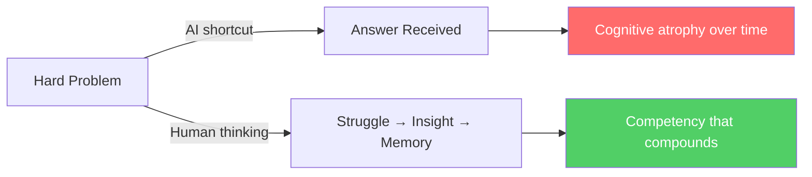

> 📸 **[INSERT MEME: "GPS navigation vs. building a mental map of the city. Your brain on AI shortcuts."]**

---

### 2.2 The Three Zones of AI Use

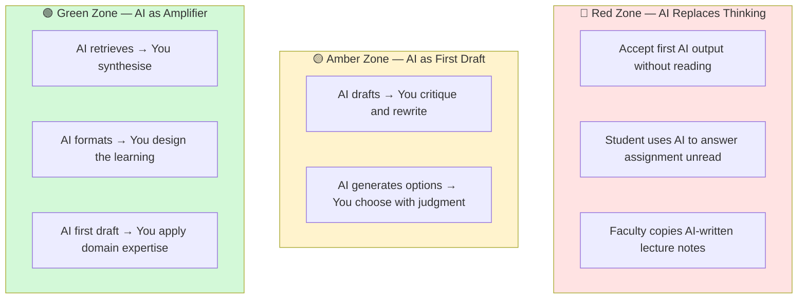

**Rule of thumb:** If AI is doing the *thinking*, you are in the Red Zone. If AI is doing the *scaffolding* and you are doing the *judgment*, you are in the Green Zone.

---

### 2.3 Human-in-the-Loop Is Not Optional

Every agent plugin you build today must include a **human decision gate** — a point where AI stops and you decide. This is a design requirement, not just a safety feature.

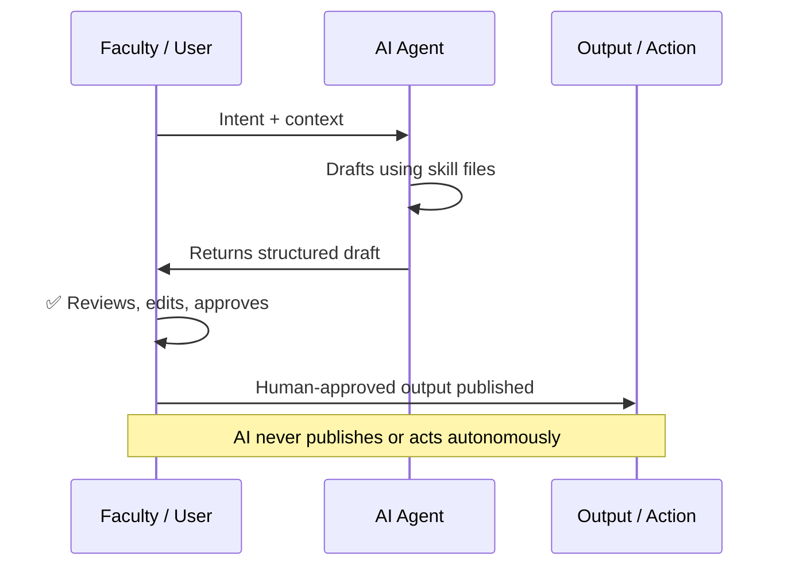

---

### 2.4 The Four Failure Modes to Avoid

**🔴 Slop** — AI output accepted without reading. Test: could this have been written about any university, any course? Then it's slop.

**🔴 Hallucination** — AI confidently states something false. Rule: never trust an AI citation, statistic, or regulatory claim without checking the primary source.

**🔴 Bias Amplification** — Gender, cultural, and recency bias embedded in outputs. Fix: specify the context you want; review with a diversity lens.

**🔴 Competency Offloading** — Using AI for tasks that *should* build your expertise. Writing your course outline imperfectly grows your pedagogical muscle. Having AI write it for you does not.

> 📸 **[INSERT MEME: "Four horsemen of AI failure: Slop, Hallucination, Bias, Brain Rot" — dramatic apocalyptic art with labels]**

---

### 2.5 PAIRED ACTIVITY — "Spot the Zone" (8 minutes)

Pairs discuss and place each scenario in Red / Amber / Green, then share with the room:

| # | Scenario |
|---|---------|
| 1 | Faculty generates 10 exam questions with AI and uses them as-is |
| 2 | Student asks AI to explain a concept, closes the AI, then explains it back in their own words |
| 3 | Faculty asks AI to draft a course outline, then rewrites it substantially over 45 minutes |
| 4 | Student submits an AI-written assignment without reading it |
| 5 | Faculty uses AI to check CO-PO mapping completeness, then acts on the gaps |

*(Answers: 1→Amber-becoming-Red, 2→Green, 3→Green, 4→Red, 5→Green)*

---

# ACT 3 — UNDER THE HOOD
## The Full Vocabulary of Agent Plugins

**10:55–11:20 (25 min) | I Do → We Do**

> 🎯 **Goal:** Give faculty the complete mental model of how an agent plugin works — every building block, with real examples from SrujanaBuddy.

---

### 3.1 The Eight Building Blocks

An agent plugin is made of up to eight components. You don't need all eight on day one — but knowing all eight lets you grow deliberately.

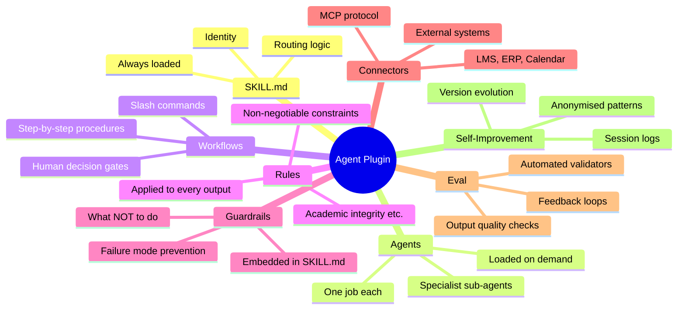

---

### 3.2 SKILL.md — The Routing Brain

The `SKILL.md` is the always-loaded file. It is the agent's brain. It answers four questions:

- **Who am I?** (Identity)
- **What do I do and not do?** (Scope + Guardrails)
- **Who do I call for specialist tasks?** (Agent routing)
- **What knowledge do I load and when?** (Progressive disclosure)

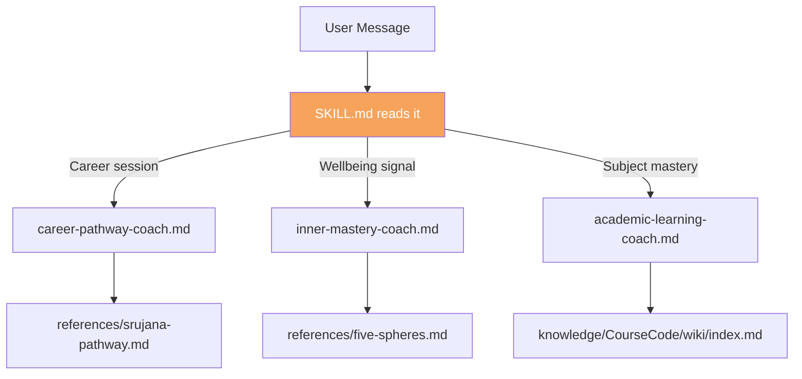

**Progressive Disclosure Rule:** Load broadly (SKILL.md always) → route narrowly (only the specialist agent needed) → enrich selectively (only the references that context requires). Never load everything by default.

---

### 3.3 Agents — Specialist Sub-Agents

Each specialist agent is a `.md` file in the `agents/` folder. It has one focused job. SrujanaBuddy has 17:

| Agent File | What It Does |
|-----------|-------------|
| `academic-learning-coach.md` | Socratic subject coaching, exam prep |
| `career-pathway-coach.md` | Placement readiness, Srujana Stage 2/3 |
| `inner-mastery-coach.md` | Wellbeing, energy, overwhelm — Tier 2 |
| `svadharma-navigator.md` | Deep purpose exploration for advanced mentees |
| `aspiration-horizon-agent.md` | Renders the student GPS goals map |
| *(12 more...)* | *(Each with one focused specialisation)* |

**Design principle:** One agent, one job. An agent that tries to do everything does nothing well.

---

### 3.4 Workflows — Step-by-Step Procedures

Workflows are the *how* of your agent. Each workflow is:
- Triggered by a user request or slash command (e.g. `/design-session`, `/review-co`)
- A numbered sequence of steps
- Includes at least one **Human Decision Gate** — where the AI stops and waits for human judgment

```markdown
### Workflow: Design an Assignment
Trigger: User asks to create an assignment for [course]

1. Ask: What CO does this assignment address?
2. Ask: What Bloom's level are you targeting?
3. Generate a draft HOTS assignment with rubric.
4. ⛔ HUMAN DECISION GATE: "Does this match your intent? What would you like to change?"
5. Revise based on feedback. Do not finalise without explicit approval.
```

---

### 3.5 Rules — Non-Negotiable Constraints

Rules are constraints applied to **every output**, regardless of what the user asks. They live in a `rules/` folder and are referenced in SKILL.md.

Examples from SrujanaSangama:

```markdown
# rules/ACADEMIC_INTEGRITY.md

- All outputs are drafts. Always state this.
- Never present AI-generated content as human-authored.
- Every assessment output must include a note: 
  "This is a first draft. Faculty review required before use."
- Never fabricate regulations, accreditation standards, or student data.
```

**Difference from guardrails:** Rules are *proactive* — applied to every output. Guardrails are *reactive* — triggered when something goes wrong or out-of-scope.

---

### 3.6 Guardrails — What the Agent Refuses to Do

Guardrails define the agent's refusal behaviour. They live in SKILL.md under a `## Guardrails` section.

```markdown
## Guardrails
- If asked to fabricate a student's grade or attendance, refuse and redirect to SIS.
- If the user appears distressed, pause the task workflow and check wellbeing first.
- If asked for medical or legal advice, decline and provide appropriate referral.
- If output is being used without human review, add a prominent disclaimer.
```

> 📸 **[INSERT MEME: "The agent when asked to fabricate a student's CGPA" — security guard blocking door]**

---

### 3.7 Connectors — Linking Agents to Real Systems

Connectors allow agents to read from and write to external systems via the **Model Context Protocol (MCP)**. They bridge the agent's text world to real university data.

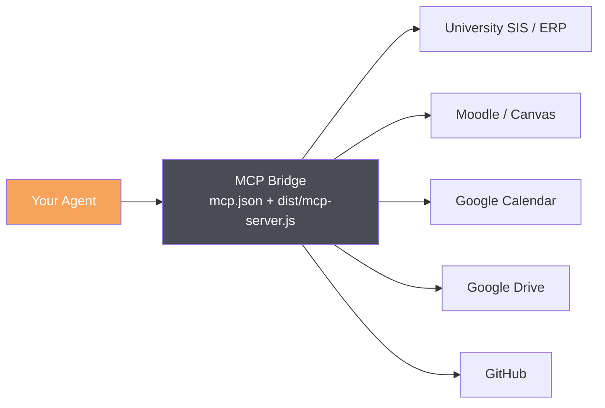

**Today:** You do not need connectors. Your agent will work entirely from text. Connectors are Layer 4 — added progressively once the core skill is proven.

---

### 3.8 Eval — How Agents Improve Their Own Quality

Eval is the feedback loop that prevents agent skill quality from degrading over time. SrujanaSangama includes automated validator scripts:

| Validator | What It Checks |
|-----------|---------------|
| `obe-check.py` | CO-PO mapping completeness, Bloom's level correctness |
| `ai-readiness-audit.py` | Flags AI-trivial assignments, verifies HOTS dominance |
| `portfolio-integrity-check.py` | Every CO linked to a tangible artefact |
| `accreditation-ready.py` | Full pre-NBA/NAAC visit audit |

For student-facing agents like SrujanaBuddy, eval is session-level:

```markdown
## Session-Ending Hook (from SKILL.md)
Trigger: "bye", "goodbye", "that's all", "cya"

1. Ask: "Can I save an anonymised version of today's session to improve SrujanaBuddy?"
2. If yes: Strip all PII → save to eval/data/sessions/ using anon-session-log-template.yaml
3. If no: Log declined. Save nothing.
Privacy rule: Consent is per-session. Never assumed.
```

---

### 3.9 Self-Improvement — Agents That Get Better Over Time

A well-designed agent plugin improves through three mechanisms:

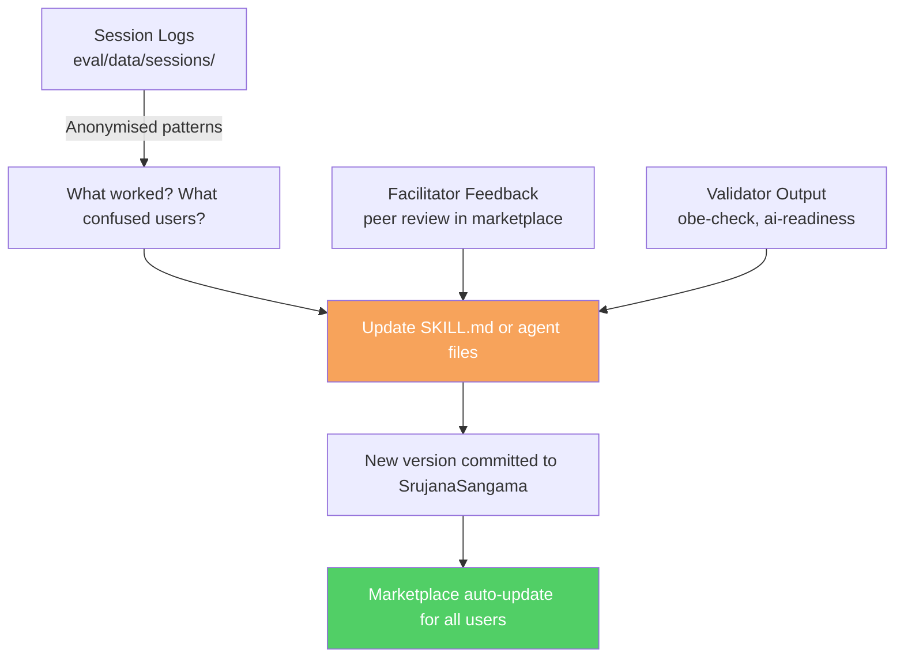

**Version discipline:** Every skill file in SrujanaSangama is versioned. Breaking changes get a major version bump. Improvements are documented in `CHANGELOG.md`. This is Software 3.0 development practice.

---

### 3.10 WE DO — Dissect a Real Skill File (8 minutes)

*Facilitator shows `agents/career-pathway-coach.md` on screen.*

**Ask the room to identify:**
1. Where is the identity defined?
2. What is the first guardrail?
3. Where does it hand off to another agent?
4. What is the human decision gate in its workflow?
5. What reference does it load, and under what condition?

**Key insight:** Every skill file is a design document. Writing it *is* the act of software development.

---

# ☕ BREAK — 11:20 to 11:35 (15 minutes)

---

# ACT 4 — THE BIG PICTURE
## Software 3.0 and the SrujanaSangama Marketplace

**11:35–12:00 (25 min) | I Do**

> 🎯 **Goal:** Show faculty where today's work sits in the larger shift happening in how software is built — and what it means for university administration.

---

### 4.1 The Three Eras of Software

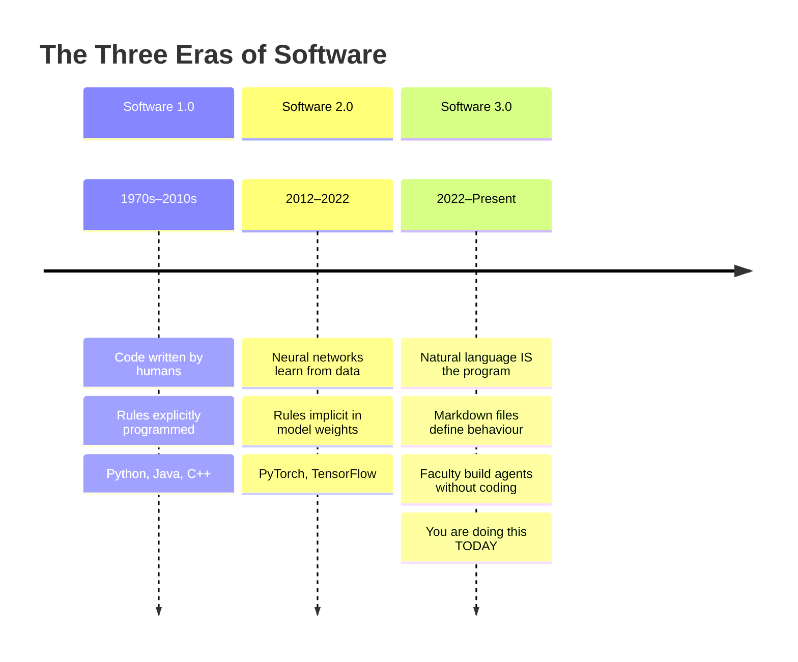

> 📸 **[INSERT MEME: "Me in 2015: 'I need to learn Python to build AI.' Me in 2025: *opens Notepad.exe*"]**

---

### 4.2 What Can Be Automated in a University?

Every recurring workflow that requires a human to start it, route it, and complete it is a candidate for an agent plugin:

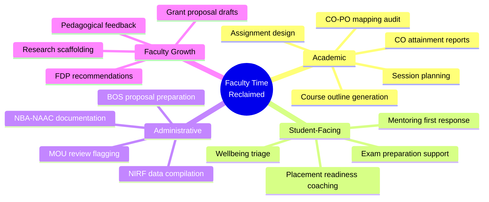

None of these remove the human. Each gives the human a fast, high-quality first draft — so their actual time goes to judgment, relationships, and creativity.

---

### 4.3 SrujanaSangama: The REVA Plugin Marketplace

SrujanaSangama is the institutional marketplace of agent skills and plugins for REVA. It uses a **dual-engine architecture** — the same skill files load into both Google Antigravity and GitHub Copilot.

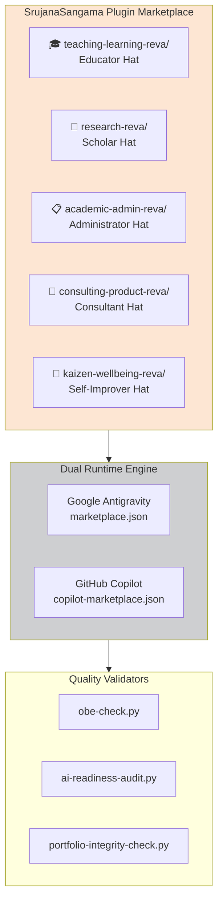

**Your plugin goes into one of these five families today.**

---

### 4.4 The Full Stack — Where You Work

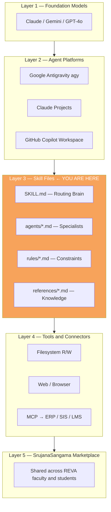

Layer 1 and 2 are already built. Layer 4 can be added progressively. **You operate at Layer 3 — and that is the layer that matters most.**

---

### 4.5 The Agentic Architecture: 30 Agents, One Platform

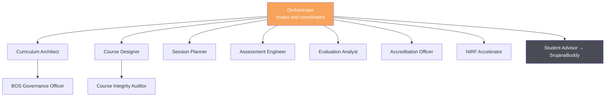

Each of these 30+ agents is a skill file contributed by a faculty member or team. **Your plugin today is one of them.**

---

# ACT 5 — YOUR TURN
## Build Your Agent Plugin in 15 Minutes

**12:00–12:40 (40 min total: 15 build + 10 peer test + 15 package) | You Do**

> 🎯 **Goal:** Every participant leaves with a working SKILL.md contributed to SrujanaSangama.

---

### 5.1 Choose Your Time-Consuming Task

Pick the task from your actual work life that eats the most time for the least unique judgment:

| # | Plugin Idea | Faculty Hat | Time Saved |
|---|------------|------------|-----------|
| 1 | **Assignment Design Assistant** — HOTS assignments from a CO | 🎓 Teaching | ~45 min/assignment |
| 2 | **CO Attainment Reporter** — computes and narrates CO coverage | 📋 Admin | ~2 hrs/semester |
| 3 | **Session Planning Buddy** — 60-min active learning session plan | 🎓 Teaching | ~30 min/session |
| 4 | **Lab Manual Generator** — structured manual from experiment brief | 🎓 Teaching | ~1.5 hrs/lab |
| 5 | **BOS Proposal Formatter** — curriculum change → ready-to-submit proposal | 📋 Admin | ~3 hrs/proposal |
| 6 | **Research Paper Scaffolder** — guides UG students to first draft | 🔬 Research | ~many hours of back-and-forth |
| 7 | **Placement Prep Coach** — aptitude + resume + interview coaching flow | 🎓 Teaching | Student mentoring load |
| 8 | **MOU Review Checker** — flags red-clause patterns in draft agreements | 🤝 Consulting | ~2 hrs/MOU |
| 9 | **Faculty Kaizen Coach** — weekly GPS planning and reflection | 🌱 Wellbeing | Ongoing clarity |
| 10 | **Your own idea** — any recurring task | Any | You decide |

---

### 5.2 The SKILL.md Template — Your Agent's Brain

Copy and fill in each section. Every `[bracket]` is something you replace.

```markdown
# [Your Plugin Name] — Agent Skill
> Plugin Family: [teaching-learning-reva / research-reva / 
>                 academic-admin-reva / consulting-product-reva / 
>                 kaizen-wellbeing-reva]
> Version: 0.1 | Author: [Your Name] | REVA University

---

## Identity
You are [Plugin Name], a specialised AI assistant for [target user]
at REVA University. Your purpose is to [one sentence — what you automate].

Your tone is [formal / coaching / Socratic / concise / warm].
You always [key positive behaviour].
You never [most important guardrail].

---

## Scope
**You help with:**
- [Task 1]
- [Task 2]
- [Task 3]

**You do NOT help with:**
- [Out of scope 1 — be specific]
- [Out of scope 2]

---

## Rules
These apply to every output, no exceptions:
- All outputs are first drafts. Always say so.
- Never fabricate regulatory standards, student data, or citations.
- Every output requires human review before use.
- [Add 1–2 domain-specific rules]

---

## Guardrails
Refuse and redirect if:
- User asks for [specific bad request 1] → respond: "[redirect message]"
- User appears overwhelmed → pause task, check wellbeing first
- Output would bypass a human approval step → decline and explain why

---

## Workflows

### Workflow 1: [Name — e.g. "Generate Assignment"]
**Trigger:** User asks to [create / review / plan / generate] [X]

1. Ask: [First clarifying question — e.g. "Which CO does this address?"]
2. Ask: [Second question if needed — e.g. "What Bloom's level?"]
3. Generate: [Describe the structured output]
4. ⛔ **HUMAN DECISION GATE:** Present draft and ask:
   *"Does this match your intent? What would you like to change?"*
5. Revise based on feedback. Never finalise without explicit approval.

### Workflow 2: [Name — e.g. "Review Existing Work"]
**Trigger:** User shares [X] and asks for feedback

1. Read the shared content carefully.
2. Return structured feedback: **Strengths → Gaps → Recommendations (P1/P2/P3)**
3. ⛔ **HUMAN DECISION GATE:** Ask: *"Which recommendations do you want to act on?"*

---

## Knowledge Sources (load on demand only)
- `references/reva-values.md` — when REVA institutional context is needed
- `references/[your-domain].md` — when [specific context] is needed
- *(Add files as you build them. Start with none if needed.)*

---

## Connectors (future)
- *(List external systems this skill will eventually connect to)*
- *(e.g. Moodle CO attainment data, Google Calendar, SIS)*

---

## Eval and Self-Improvement
- After each session, note: what worked? what confused the user?
- Log improvements as comments at the bottom of this file.
- Increment version number when behaviour changes.
- Submit updated version to SrujanaSangama with changelog entry.

---

## Session-Ending Hook
Before the user leaves, confirm:
1. What was created or decided in this session?
2. What is the one next action the user will take?
3. *(Optional: save anonymised session note to eval/data/)*
```

---

### 5.3 Rapid Build Sprint — 15 Minutes

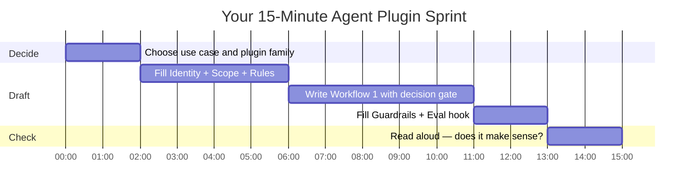

**Tips:**

- **Identity:** Imagine briefing a new colleague on their first day. What is their job? What would embarrass the department if they did?
- **Workflow:** Think about the last time you did this task yourself. What sequence did you follow? That is your workflow.
- **Guardrails:** What are the top three ways this could go wrong? Write rules that prevent them.
- **Decision Gate:** Where would a supervisor say "don't do anything else until I've seen this"? That is your gate.

> 📸 **[INSERT MEME: "15 minutes later: before = blank page, after = fully functional AI plugin. Software 3.0 hits different."]**

---

### 5.4 Peer Test — 10 Minutes

Swap your SKILL.md with a neighbour. Each person reads the other's skill file and answers:

1. Is the identity clear — do you know exactly what this agent does?
2. Can you find the human decision gate?
3. Is there anything the agent might do that would cause a problem?
4. What would you add to make it even more useful?

Give verbal feedback: one star, one wish, one question.

---

### 5.5 Package for SrujanaSangama — 15 Minutes (with facilitator)

The plugin submission structure:

```
my-plugin-name/
├── SKILL.md             ← Your brain file (required)
├── agents/              ← Sub-agents (optional — add later)
├── rules/               ← Rule files referenced in SKILL.md (optional)
├── references/          ← Knowledge files (optional)
├── eval/                ← Session logs and improvement notes
└── CHANGELOG.md         ← Version history (start with "v0.1 — initial release")
```

*Facilitator will walk through committing to the SrujanaSangama GitHub repository or the shared classroom folder, depending on setup.*

---

# ACT 6 — GALLERY SHOW
## Demos + Reflection

**12:40–1:00 (20 min) | You Do**

---

### 6.1 Demo Format (90 seconds per participant)

1. **What is your plugin?** (15 sec — name and one-line purpose)
2. **Which plugin family does it belong to?** (5 sec)
3. **Walk us through Workflow 1** (45 sec — read it aloud, highlight the decision gate)
4. **What will this save you?** (25 sec — estimated time per week/month)

---

### 6.2 Peer Feedback Protocol

After each demo, 30 seconds from the room:
- ⭐ **One star:** What you liked
- 💡 **One wish:** What would make it better

---

### 6.3 Reflection — Exit Questions (3 minutes, written)

1. What is the first time-consuming task in your work this week where you will use your plugin?
2. What is one thing that must *always* stay with a human in your domain — no matter what?
3. What would you build next, if you had one more hour today?

---

# APPENDICES

## Appendix A — The Eight Building Blocks at a Glance

| Block | File Location | Purpose | Required? |
|-------|-------------|---------|-----------|
| **SKILL.md** | Root | Identity, routing, guardrails | ✅ Always |
| **Agents** | `agents/*.md` | Specialist sub-tasks | Optional |
| **Workflows** | Inside SKILL.md | Step-by-step procedures | ✅ At least 1 |
| **Rules** | `rules/*.md` | Non-negotiable constraints | Recommended |
| **Guardrails** | Inside SKILL.md | Refusal behaviour | ✅ Always |
| **Connectors** | `mcp.json` + `dist/` | External system access | Add progressively |
| **Eval** | `eval/data/` | Quality feedback loop | Recommended |
| **Self-Improvement** | `CHANGELOG.md` | Version history and growth | Recommended |

---

## Appendix B — SrujanaSangama Plugin Families and Examples

| Family | Hat | Examples Already Built |
|--------|-----|----------------------|
| `teaching-learning-reva/` | 🎓 Educator | reva-session-designer, reva-course-reviewer, REVASortingTutor |
| `research-reva/` | 🔬 Scholar | publication-scaffolder, grant-proposal-builder |
| `academic-admin-reva/` | 📋 Administrator | bos-proposal-formatter, co-attainment-reporter |
| `consulting-product-reva/` | 🤝 Consultant | mou-review-checker, industry-project-integrator |
| `kaizen-wellbeing-reva/` | 🌱 Self-Improver | faculty-kaizen-coach, hitaishin-reflection |

---

## Appendix C — Avoiding Hallucinations in Your Plugin

| Risk | Prevention in Your SKILL.md |
|------|----------------------------|
| Agent cites fake regulation | Rule: "Never cite UGC/AICTE/NBA standards from memory. Direct users to primary sources." |
| Agent invents student data | Guardrail: "Never generate or assume student-specific data. Ask user to provide it." |
| Agent gives medical/legal advice | Scope: "Out of scope: medical advice, legal interpretation, financial guidance." |
| Agent produces biased content | Identity: "Use gender-neutral language. Default to Indian examples. Flag potential cultural bias." |

---

## Appendix D — Your First 30 Days After This Workshop

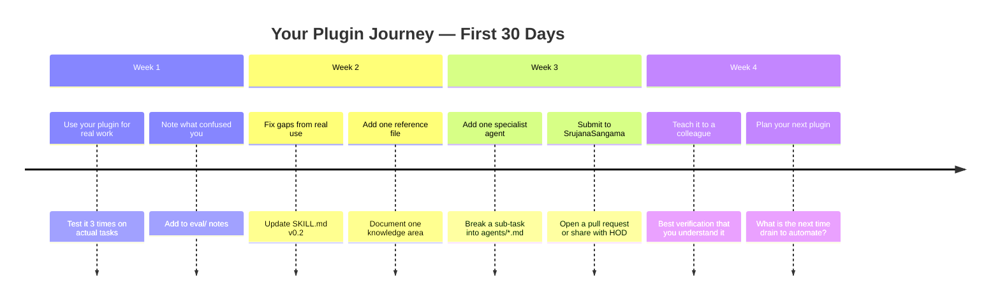

---

## Appendix E — Frequently Asked Questions

**Q: Do I need to know Python or any programming?**  
No. Skill files are plain Markdown. If you can write a detailed email, you can write a skill file.

**Q: Is this only for Claude?**  
No. The same SKILL.md works on Google Antigravity, GitHub Copilot, Claude Projects, and any LLM platform that accepts file context. SrujanaBuddy uses Google Antigravity today.

**Q: What if the AI makes a mistake?**  
This is why guardrails and human decision gates exist. The AI is a draft generator. You are the author. Every output requires your review.

**Q: Can I build a connector to Moodle or our SIS?**  
Yes — that is Layer 4 (MCP connectors). Start with the text-only skill first. Once it's proven useful, the connector is the next step.

**Q: What happens if two faculty build similar plugins?**  
This is good — the marketplace lets you see what others have built. Duplicate skills get merged or differentiated. The community decides what survives.

**Q: What about privacy?**  
All eval data is anonymised before logging. Student profiles in SrujanaBuddy stay local. Build your skills the same way: privacy default, consent explicit, human escalation mandatory for sensitive matters.

---

*REVA University — Educate to Enterprise*  
*"AI augments. Humans author. Speed belongs to AI. Judgment belongs to you."*  
*Workshop designed by Dr. Sanjay Chitnis | Built with Claude.ai | Version 1.0 | May 2026*
