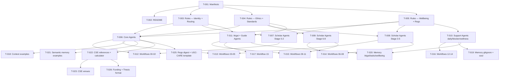

# tasks-revaPhDScholar.md — Coordinator Agent Output

> **Spec contract:** `plan/plan-revaPhDScholar.prompt.md`
> **Generated by:** Coordinator Agent (acting as per AGENTS.md §3.1)
> **Status:** Awaiting Product Owner review — no implementation until approved
> **Governance:** CONSTITUTION.md §13 (≤3 files, ≤1 hr per task). PO may override file limit in writing for scaffolding-only tasks.
> **Last updated:** 2026-06-01

---

## Blockers — Phase 0 Input Materials *(must be resolved before marked tasks can begin)*

These are user-provided materials, not Implementor tasks. Implementation tasks that depend on them are flagged `[BLOCKED: Phase 0]`.

| # | Material | Blocks |
|---|---|---|
| ~~B-1~~ | ~~REVA PhD Regulations Sections 14+ (publication, submission, examination rules)~~ | ✅ **RESOLVED 2026-06-01** — Full REVA PhD Regulations 2025 text provided by PO at `references/reva-PhD-regulations.md`. Section 14 (publication minimums §14.1, pre-submission colloquium §14.2, synopsis/examiner panel §14.3, thesis submission deadlines §14.4), Section 15 (evaluation, viva voce), Sections 16–21 (INFLIBNET, notification, plagiarism, change of title) all available. T-005, T-008, T-013, T-014, T-025 fully unblocked. |
| ~~B-2~~ | ~~CSE publication venues list (IEEE/ACM/Springer tiers)~~ | ✅ **RESOLVED 2026-06-01** — Full venue taxonomy provided by PO. T-023 unblocked. |
| ~~B-3~~ | ~~India funding landscape digest (SERB/DST/DBT/CSIR/UGC)~~ | ✅ **RESOLVED 2026-06-01** — Full funding knowledge base v2.0 provided by PO. T-026 `india-funding-landscape.md` unblocked. T-014 `08_grant-proposal.md` unblocked. |
| ~~B-4~~ | ~~REVA thesis format template (Word/LaTeX)~~ | ✅ **RESOLVED 2026-06-01** — Appendix 4 of REVA PhD Regulations 2025 provides complete thesis format guidelines (paper quality, typeface, margins, spacing, orientation, chapter order, pagination, submission package, restrictions). T-026 `thesis-format-guide.md` fully unblocked. |
| ~~B-5~~ | ~~UGC CARE + Scopus/WoS guidance content~~ | ⚠️ **DROPPED AS BLOCKER 2026-06-01** — UGC now requires each university to maintain its own approved journal list. REVA's list is pending preparation by the Research Cell. `ugc-care-guidance.md` (T-025) will be implemented as a template/placeholder that REVA fills in when ready. T-025 no longer blocked by this. |
| ~~B-6~~ | ~~Branch placeholder confirmation (ECE/Management/Life Sciences names)~~ | ⚠️ **DROPPED AS BLOCKER 2026-06-01** — T-024 will proceed using standard school names (ECE, Management, Life Sciences) as placeholder labels. Names can be updated when formally confirmed by the PO. |

---

## Phase 1 — Plugin Scaffolding

> Spec clause: `plan-revaPhDScholar.prompt.md § Phase 1`
> Gate: Product Owner approval required before any Phase 1 task begins.

| Task | Files (≤3) | Change | Est. | Status | Dependencies |
|---|---|---|---|---|---|
| **T-001** | `plugins/phd-scholar/plugin.json`, `plugins/phd-scholar/package.json` | CREATE | 30 min | not-started | None |
| **T-002** | `plugins/phd-scholar/README.md` | CREATE | 30 min | not-started | T-001 |

### T-001 Detail
- **Affected files (2):** `plugins/phd-scholar/plugin.json`, `plugins/phd-scholar/package.json`
- **Change type:** CREATE
- **Spec clause:** Phase 1 — Plugin Scaffolding
- **plugin.json:** id `reva.phd-scholar`, version `1.0.0`, lists all 8 rules + 16 workflows, registers `/guide` slash command; no `mcpConfig` (Phase 1)
- **package.json:** Copilot agent name `phd-scholar`, slash command `/guide`, publisher `reva-university`, engines `vscode ^1.85.0`

### T-002 Detail
- **Affected files (1):** `plugins/phd-scholar/README.md`
- **Change type:** CREATE
- **Spec clause:** Phase 1 — Plugin Scaffolding
- **Content:** Plugin overview — purpose, dual persona, 9-stage lifecycle summary, school routing note, cross-plugin dependencies, Phase 0 blockers table

---

## Phase 2 — Rules Layer

> Spec clause: `plan-revaPhDScholar.prompt.md § Phase 2`
> CONSTITUTION §6: every rules file must have YAML frontmatter (`name`, `description`, `version`, `tags`) and define enforcement levels explicitly (`advisory` / `warning` / `hard stop`).

| Task | Files (≤3) | Change | Est. | Status | Dependencies |
|---|---|---|---|---|---|
| **T-003** | `rules/SCHOLAR_IDENTITY.md`, `rules/GUIDE_IDENTITY.md`, `rules/SCHOOL_ROUTING.md` | CREATE | 45 min | not-started | T-001 |
| **T-004** | `rules/RESEARCH_ETHICS.md`, `rules/PUBLICATION_STANDARDS.md`, `rules/IKIGAI_ALIGNMENT.md` | CREATE | 45 min | not-started | T-001 |
| **T-005** | `rules/WELLBEING_STANDARD.md`, `rules/REVA_PHD_REGULATIONS.md` | CREATE | 45 min | not-started | T-001 |

### T-003 Detail
- **Affected files (3):** `plugins/phd-scholar/rules/SCHOLAR_IDENTITY.md`, `GUIDE_IDENTITY.md`, `SCHOOL_ROUTING.md`
- **SCHOLAR_IDENTITY.md:** Default persona — empathetic stage-aware coach; enforcement: advisory by default, hard stop for regulation violations; role: guide (not decide) the scholar
- **GUIDE_IDENTITY.md:** Activated by `/guide` slash command; strategic supervisor advisor persona; scholar persona suppressed when active
- **SCHOOL_ROUTING.md:** Branch detection logic — loads CSE materials for CSE/CSA; for all other schools triggers graceful placeholder message (CONSTITUTION §11 exact wording required); enforcement: hard stop on serving CSE content to non-CSE scholars

### T-004 Detail
- **Affected files (3):** `plugins/phd-scholar/rules/RESEARCH_ETHICS.md`, `PUBLICATION_STANDARDS.md`, `IKIGAI_ALIGNMENT.md`
- **RESEARCH_ETHICS.md:** Fork of `research-reva/rules/RESEARCH_ETHICS.md` with attribution header; extends for PhD context (RPE course, SIGSOFT standards, plagiarism thresholds per REVA regs)
- **PUBLICATION_STANDARDS.md:** Fork of `research-reva/rules/GRANT_PROPOSAL_STANDARD.md` (publication section only) with attribution; adds UGC CARE guidance, predatory red flag checklist, conference tier tags; enforcement: warning on tier-mismatch, hard stop on predatory journals
- **IKIGAI_ALIGNMENT.md:** Defines ikigai check triggers (onboarding, stage transitions, disengagement signals); 4-quadrant model (passion × strength × world-need × career goal); enforcement: advisory

### T-005 Detail
- **Affected files (2):** `plugins/phd-scholar/rules/WELLBEING_STANDARD.md`, `REVA_PHD_REGULATIONS.md`
- **WELLBEING_STANDARD.md:** When to suggest break vs. escalate; PhD-specific mental health red flags (isolation, imposter syndrome, burnout); self-care protocol; escalation path to REVA counselling; references `kaizen-wellbeing-reva` plugin; enforcement: advisory + escalation
- **REVA_PHD_REGULATIONS.md:** Distilled hard rules — minimum 3-year duration (hard stop; §4.1), maximum 8 years (extendable; §4.2), 10-year annulment (§4.5), credit floors per candidate type (§9.7: 18 FT/PT standard | 30 industrial experience | 46 four-year degree | 50 foreign/other-domain), publication minimums for 2018+ batch (§14.1): option A: 3 Scopus/WoS/UGC peer-reviewed + 1 reputed conference; option B: 2 Scopus/WoS/UGC + 1 granted patent + 1 conference; option C: 2 Q1/Q2 + 1 conference — Engineering/Applied Sciences must have ≥1 Q1/Q2/Q3 journal; scholar as main author, guide/co-guide as co-authors; plagiarism ceiling 10% (§14.4b-ii); pre-submission colloquium required (§14.2); change-of-title only before pre-submission colloquium (§18). **Every citation must include section number.** Source: `references/reva-PhD-regulations.md` (B-1 resolved 2026-06-01).

---

## Phase 3 — Agents Layer

> Spec clause: `plan-revaPhDScholar.prompt.md § Phase 3`
> CONSTITUTION §3: agent files go in `agents/core/`, `agents/scholar/`, `agents/guide/` subfolders.
> Agent files contain only Markdown instructions — no code.

| Task | Files (≤3) | Change | Est. | Status | Dependencies |
|---|---|---|---|---|---|
| **T-006** | `agents/core/orchestrator.md`, `agents/core/stage-tracker.md` | CREATE | 45 min | not-started | T-003, T-004, T-005 |
| **T-007** | `agents/scholar/topic-scout.md`, `agents/scholar/coursework-navigator.md`, `agents/scholar/synopsis-builder.md` | CREATE | 45 min | not-started | T-003, T-005 |
| **T-008** | `agents/scholar/research-coach.md`, `agents/scholar/publication-coach.md`, `agents/scholar/thesis-writer.md` | CREATE | 45 min | not-started | T-004, T-005 |
| **T-009** | `agents/scholar/patent-agent.md`, `agents/scholar/grant-agent.md`, `agents/scholar/book-agent.md` | CREATE | 45 min | not-started | T-004 |
| **T-010** | `agents/scholar/daily-planner.md`, `agents/scholar/blocker-breaker.md`, `agents/scholar/wellness-companion.md` | CREATE | 45 min | not-started | T-005 |
| **T-011** | `agents/scholar/ikigai-compass.md`, `agents/guide/guide-advisor.md` | CREATE | 30 min | not-started | T-003, T-004 |

### T-006 Detail
- **orchestrator.md:** Routes Scholar vs. `/guide` mode based on slash command detection; activates correct stage agent based on `stage-tracker.md` output; delegates to appropriate scholar/support agents; handles session open/close handoff
- **stage-tracker.md:** Auto-computes milestone dates from provisional registration date + candidate type + supervisor-confirmed progress inputs; output: structured timeline table; re-computes at each biannual review; spec for auto-compute logic lives in `references/phd-milestone-calculator.md`

### T-007 Detail
- **topic-scout.md:** Stage 0 — research area mapping, guide eligibility check (Section 7.2 caps — cite section), topic feasibility assessment; outputs: ranked topic shortlist, guide candidates list
- **coursework-navigator.md:** Stage 1 — credit pathway routing (18/30/46/50 per candidate type), ARM/RPE coaching, IA-I/IA-II/CWEE preparation; must reference REVA_PHD_REGULATIONS.md credit tables
- **synopsis-builder.md:** Stage 2 — pre-registration colloquium prep; synopsis structure template (background, objectives, hypotheses, methodology, expected contributions); presentation coaching

### T-008 Detail
- **research-coach.md:** Stage 3 — lit review protocol (PRISMA-lite), methodology selection per CSE Handbook + SIGSOFT standards, experiment design templates, biannual progress report scaffolding; must not use "significant" to mean "large" (CONSTITUTION §15)
- **publication-coach.md:** Stage 4 — paper targeting, drafting protocol, reviewer response coaching, publication minimum tracker per §14.1 (2018+ batch: option A: 3 Scopus/WoS/UGC + 1 conf; option B: 2 Scopus/WoS/UGC + 1 granted patent + 1 conf; option C: 2 Q1/Q2 + 1 conf; Engineering/Applied Sciences ≥1 Q1/Q2/Q3 journal; scholar must be main author; at least one publication active at submission time)
- **thesis-writer.md:** Stage 5 — chapter-by-chapter guidance, REVA format compliance per Appendix 4 (A4 white one-sided, 11pt min font, 1.5-inch binding margin, 1-inch other margins, 1.5×/double spacing, chapter order: Title → Certificate → Preface/Ack → ToC → List of Tables → List of Illustrations → Abstract → Chapters → References → Appendices → Bibliography, Roman for prelims, Arabic for body), pre-submission colloquium protocol per §14.2, plagiarism self-check (ceiling 10% per §14.4b-ii)

### T-009 Detail
- **patent-agent.md:** Stage 6 — IP identification → invokes `plugins/patent-generator/workflows/` chain (no duplication; reference by path per CONSTITUTION §10); adapts prompts for PhD scholar context
- **grant-agent.md:** Stage 7 — India grant calendar, SERB/DST/DBT/ICMR/UGC proposal structures; adapts `research-reva/workflows/funding-hunt.md` (fork with attribution per CONSTITUTION §10); references `references/india-funding-landscape.md` (B-3 content available)
- **book-agent.md:** Stage 8 — research monograph / book proposal structure; publisher targeting (academic presses, Springer, Elsevier); chapter outline template; audience scoping

### T-010 Detail
- **daily-planner.md:** All stages — breaks current milestone into weekly/daily micro-tasks (2–4 hrs each); anti-procrastination nudges; tracks completion; outputs ≥3 specific doable tasks on every session open; feeds into `memory/tasks.md`
- **blocker-breaker.md:** All stages — "I'm stuck" triage: classifies blocker as conceptual / methodological / motivational / regulatory / interpersonal; routes to: concept explainer, methodology coach, motivational reframe, regulation lookup, or guide escalation respectively
- **wellness-companion.md:** All stages — immediate wellbeing check-ins; PhD-specific patterns (isolation, imposter syndrome, burnout); actionable self-care nudges; escalation path to REVA counselling services; references `kaizen-wellbeing-reva` plugin for deep support; uses WELLBEING_STANDARD.md enforcement levels

### T-011 Detail
- **ikigai-compass.md:** All stages — research–ikigai alignment checks at onboarding and each stage transition; 4-quadrant map (passion × strength × world-need × career goal); detects disengagement signals; outputs alignment score + reflection prompts; uses IKIGAI_ALIGNMENT.md
- **guide-advisor.md:** Activated by `/guide`; scholar roster view, milestone status per scholar, feedback protocol templates (progress review, course completion, colloquium sign-off), co-guide coordination notes; uses GUIDE_IDENTITY.md

---

## Phase 4 — Workflows Layer

> Spec clause: `plan-revaPhDScholar.prompt.md § Phase 4`
> CONSTITUTION §7: every workflow must begin with `<!-- Paste this... -->` comment, define a Session Type header, number phases with time estimates, end with output template.

| Task | Files (≤3) | Change | Est. | Status | Dependencies |
|---|---|---|---|---|---|
| **T-012** | `workflows/00_onboarding.md`, `workflows/01_entrance-prep.md`, `workflows/02_coursework.md` | CREATE | 45 min | not-started | T-003, T-006 |
| **T-013** | `workflows/03_synopsis.md`, `workflows/04_research-cycle.md`, `workflows/05_publication-pipeline.md` | CREATE | 45 min | not-started | T-006, T-007, T-008 |
| **T-014** | `workflows/06_thesis-sprint.md`, `workflows/07_patent-workflow.md`, `workflows/08_grant-proposal.md` | CREATE | 45 min | not-started | T-008, T-009 |
| **T-015** | `workflows/09_book-proposal.md`, `workflows/10_guide-dashboard.md`, `workflows/11_session-closer.md` | CREATE | 45 min | not-started | T-009, T-011 |
| **T-016** | `workflows/12_daily-standup.md`, `workflows/13_stuck-triage.md`, `workflows/14_wellness-checkin.md` | CREATE | 45 min | not-started | T-010 |
| **T-017** | `workflows/15_ikigai-audit.md` | CREATE | 30 min | not-started | T-011 |

### T-012 Detail
- **00_onboarding.md:** Profile setup session — school, batch, provisional registration date, candidate type (auto-sets credit pathway), guide name, current stage, ikigai seed (passion, domain, aspiration); writes to `memory/soul.md` and `memory/ikigai.md`
- **01_entrance-prep.md:** Topic ideation, guide eligibility check (Section 7.2), entrance test prep (RM + subject-specific), interview coaching (mock Q&A, research interest articulation, 10-min presentation dry run)
- **02_coursework.md:** Course schedule routing per pathway, credit tracking dashboard, IA-I/IA-II/CWEE preparation protocol

### T-013 Detail
- **03_synopsis.md:** Synopsis template walkthrough (all 5 sections), colloquium presentation structure and coaching, Q&A preparation
- **04_research-cycle.md:** Biannual review cycle protocol, experiment logging, lit review (PRISMA-lite), progress report scaffolding, stage-tracker refresh
- **05_publication-pipeline.md:** Paper ideation → journal/conference targeting → drafting → submission → revision loop; publication minimum tracker dashboard showing §14.1 criteria (option A/B/C) with per-option completion status; at-submission active-publication check

### T-014 Detail
- **06_thesis-sprint.md:** Pre-submission checklist, chapter plan, REVA format compliance check per Appendix 4 (paper quality, 11pt font, 1.5-inch binding margin, 1-inch others, 1.5×/double spacing, correct chapter order, pagination), plagiarism self-check (ceiling 10% per §14.4b-ii), pre-submission colloquium protocol per §14.2 (letter of intent → internal review → colloquium), synopsis submission and examiner panel process per §14.3 (panel of 12 examiners, BoS Chair within 4 weeks)
- **07_patent-workflow.md:** IP identification → invokes `patent-generator` workflow chain (`plugins/patent-generator/workflows/01_input.md` → `08_export.md`); scholar context adapter
- **08_grant-proposal.md:** Grant calendar, SERB/DST/DBT template selection, budget planning, submission checklist; adapts `research-reva/workflows/funding-hunt.md` [finalize after B-3]

### T-015 Detail
- **09_book-proposal.md:** Publisher targeting, chapter outline builder, audience scoping, proposal structure template
- **10_guide-dashboard.md:** `/guide` mode — scholar roster, milestone status table, feedback template library (progress review, colloquium sign-off), co-guide coordination
- **11_session-closer.md:** End-of-session memory capture — appends to `memory/semantic/episodic/`; refreshes `memory/tasks.md` next actions; updates milestone dates in `memory/semantic/research-pipeline.md`

### T-016 Detail
- **12_daily-standup.md:** Quick daily/weekly micro-planning — yesterday / today / blockers format; outputs 3 specific doable tasks (2–4 hrs each); feeds `daily-planner.md`; anti-procrastination framing
- **13_stuck-triage.md:** "Help, I'm stuck" — blocker classification tree (conceptual / methodological / motivational / regulatory / interpersonal); each branch routes to targeted intervention or escalation
- **14_wellness-checkin.md:** Periodic wellbeing pulse — PhD stress indicators, isolation, imposter syndrome, burnout signals; actionable nudges; escalation path to REVA support services and `kaizen-wellbeing-reva`

### T-017 Detail
- **15_ikigai-audit.md:** Research–purpose alignment review — 4-quadrant ikigai map (passion × strength × world-need × career goal); annual cadence at each biannual review + on-demand trigger; outputs: alignment score, tension areas, renewal actions

---

## Phase 5 — Context & Memory Templates

> Spec clause: `plan-revaPhDScholar.prompt.md § Phase 5`
> CONSTITUTION §8: every live memory file must have a committed `.example` counterpart; `memory/` must have `.gitignore` blocking all non-example files.

| Task | Files (≤3) | Change | Est. | Status | Dependencies |
|---|---|---|---|---|---|
| **T-018** | `context/scholar-profile.md.example`, `context/research-tracker.md.example`, `context/publication-pipeline.md.example` | CREATE | 30 min | not-started | T-006 |
| **T-019** | `context/daily-log.md.example`, `memory/.gitignore`, `memory/soul.md.example` | CREATE | 30 min | not-started | T-010 |
| **T-020** | `memory/ikigai.md.example`, `memory/tasks.md.example`, `memory/wellbeing-log.md.example` | CREATE | 30 min | not-started | T-010, T-011 |
| **T-021** | `memory/semantic/research-pipeline.md.example`, `memory/semantic/publication-log.md.example`, `memory/semantic/progress-reports.md.example` | CREATE | 30 min | not-started | T-006 |

### T-018 Detail
- **scholar-profile.md.example:** school, batch, provisional registration date, candidate type (FT/PT/Sponsored/Direct PhD), guide name, current stage, co-guide, ikigai fields (passion areas, domain strengths, societal need, career goal) — all fields annotated with guidance text
- **research-tracker.md.example:** Milestone log table, biannual review dates, computed deadline table (from `stage-tracker.md`), pending actions, supervisor sign-off log
- **publication-pipeline.md.example:** Paper title, target venue, venue tier (Q1/Q2/Q3/A/B), submission status, submission date, decision date, reviewer response summary

### T-019 Detail
- **daily-log.md.example:** Current micro-task list (max 5 items, each 2–4 hrs), blocker notes, daily standup history (rolling 7 days), mood/energy quick capture
- **memory/.gitignore:** Block all `*.md` files EXCEPT `*.md.example` files; allow `episodic/` subdirectory creation but block `episodic/*.md`; standard gitignore pattern
- **soul.md.example:** Scholar identity — name, school, batch, registration date, research domain, career aspiration, learning style, communication preferences, core strengths, acknowledged fears, primary motivators — all fields annotated

### T-020 Detail
- **ikigai.md.example:** 4-quadrant ikigai map with annotated empty fields per quadrant; current alignment score (1–10) + rationale; tension areas; last reviewed date; renewal actions list
- **tasks.md.example:** Active task list — milestone name, weekly tasks, daily micro-tasks; each task has: status (todo/in-progress/done/blocked), due date, blocker notes, estimated duration
- **wellbeing-log.md.example:** Periodic check-in template — date, mood (1–5), stress level (1–5), workload rating (1–5), what's draining energy, what's restoring it, self-care actions taken, escalation flag (none/counselling-signpost/urgent)

### T-021 Detail
- **research-pipeline.md.example:** Active research threads with lifecycle stage (ideation → data-collection → analysis → writing → under-review → published → parked); hypothesis, methodology note per thread; cross-links to publication-log
- **publication-log.md.example:** Paper title, venue, tier, submission date, status (in-prep/submitted/under-review/revision/accepted/rejected/published), reviewer response notes, acceptance/rejection notes, DOI on publication
- **progress-reports.md.example:** Biannual progress report history — report period, guide remarks, DRPC committee feedback, corrective actions required, corrective actions completed, sign-off status

---

## Phase 6 — References Folder

> Spec clause: `plan-revaPhDScholar.prompt.md § Phase 6`
> CONSTITUTION §10: copy from `references/` root using attribution header; do not re-derive without citing source.

| Task | Files (≤3) | Change | Est. | Status | Dependencies |
|---|---|---|---|---|---|
| **T-022** | `references/schools/cse/researcher-handbook.md`, `references/schools/cse/methodology-guide.md`, `references/phd-milestone-calculator.md` | CREATE | 45 min | not-started | T-006 |
| **T-023** | `references/schools/cse/publication-venues.md` | CREATE | 45 min | not-started | ~~B-2~~ ✅ unblocked |
| **T-024** | `references/schools/ece/researcher-handbook.md.placeholder`, `references/schools/management/researcher-handbook.md.placeholder` | CREATE | 15 min | not-started | ~~B-6~~ ✅ unblocked — use standard names |
| **T-025** | `references/reva-phd-regulations-digest.md`, `references/ugc-care-guidance.md` | CREATE | 45 min | not-started | ~~B-1~~ ✅ |
| **T-026** | `references/india-funding-landscape.md`, `references/thesis-format-guide.md` | CREATE | 60 min | not-started | ~~B-3~~ ✅, ~~B-4~~ ✅ |

### T-022 Detail
- **references/schools/cse/researcher-handbook.md:** Attribution header citing `references/The CSE Researcher's Handbook.md`; copy key sections relevant to PhD methodology (empirical research standards, SIGSOFT guidelines, research process); omit faculty-facing sections
- **references/schools/cse/methodology-guide.md:** Distilled from CSE Handbook + SIGSOFT standards; covers: choosing research methodology (empirical, design science, survey, case study), experiment design, validity threats, statistical guidance (no misuse of "significant" — CONSTITUTION §15)
- **references/phd-milestone-calculator.md:** Spec document for `stage-tracker.md` auto-compute logic — inputs (registration date, candidate type, progress confirmations), derivation rules for each milestone (synopsis by month N, RPC by month M, etc.), output format (structured table)

### T-023 Detail
- **references/schools/cse/publication-venues.md:** Comprehensive publication venue guide for REVA PhD scholars in CSE/CSA. Content provided by PO (2026-06-01). Structured as follows:

#### File Structure for `publication-venues.md`

**Preamble** — framing note: in CS, top-tier conference proceedings carry research weight equivalent to high-impact journals (cite: Meho 2019, doi:10.1016/j.joi.2019.02.006); Scopus and WoS serve as baseline tracking standards in Indian academia (cite: Pranckutė 2021, doi:10.3390/publications9010012). Cross-reference all venues against live Scopus Source List and UGC-CARE Group II portal before submission — venues shift quartiles and can be discontinued.

**Section 1 — Top IEEE & ACM Flagship Conferences (Global Tier)**
Acceptance rates 12%–20%. Submitting here places research on the world stage.

| Conference | Domain | Notes |
|---|---|---|
| ACM SIGCOMM | Computer Networks & Data Communication | Gold standard |
| IEEE INFOCOM | Computer Networks & Data Communication | Gold standard |
| IEEE/CVF CVPR | Computer Vision & Pattern Recognition | Ultimate venue |
| IEEE/CVF ICCV | Computer Vision & Pattern Recognition | Ultimate venue |
| ACM SIGKDD | Knowledge Discovery & Data Mining | Premier |
| IEEE ICDE | Data Engineering & Databases | Flagship |
| IEEE GLOBECOM | Communications (global regions, alternating) | IEEE ComSoc flagship |
| IEEE ICC | Communications (global regions, alternating) | IEEE ComSoc flagship |

**Section 2 — Premier Conferences by Indian Institutions**
Tech-sponsored by IEEE/ACM; strong networking with IISc, IIT, and global lab scientists. High weight in Indian academic circles.

| Acronym | Full Name | Organising Body | Domain |
|---|---|---|---|
| COMSNETS | International Conference on Communication Systems & NETworkS | Jointly managed (often Bengaluru) | Networking, IoT, Cloud |
| HiPC | IEEE International Conference on High Performance Computing, Data, and Analytics | IEEE Computer Society / India chapters | Parallel Computing, Big Data, AI |
| ICDCN | International Conference on Distributed Computing and Networking | Rotates across IITs / IIITs | Distributed Systems, Wireless Mesh |
| ICVGIP | Indian Conference on Computer Vision, Graphics and Image Processing | IUPRAI | Vision, Graphics, AR/VR |
| ISEC | Innovations in Software Engineering Conference | ACM SIGSOFT / iSOFT | Software Architectures, DevOps, Agile |
| NCC | National Conference on Communications | IITs + IISc (jointly) | Signal Processing, Telecom, Networks |

**Section 3 — Scopus-Indexed & WoS Q-Rated Journals**
Safe route for meeting institutional graduation checks (SCIE / Scopus indexed).

*Q1 — Highest Impact & Rigor*
- IEEE Internet of Things Journal — top choice for smart architectures
- IEEE Transactions on Pattern Analysis and Machine Intelligence (TPAMI)
- IEEE Transactions on Knowledge and Data Engineering (TKDE)
- ACM Transactions on Computer Systems (TOCS)

*Q2 — Balanced Peer-Review & High Visibility*
- Knowledge-Based Systems (Elsevier)
- Pattern Recognition Letters (Elsevier)
- Journal of Network and Computer Applications (Elsevier)
- Applied Soft Computing (Elsevier)

*Q3 / Q4 — Accessible for Early-to-Mid Stage Research*
- PeerJ Computer Science (open-access; AI, software engineering, cybersecurity)
- International Journal of Information Security and Privacy (IGI Global)
- Journal of Computer Science (Science Publications)

**Section 4 — Top Indian Journals (UGC-CARE List Group II)**
Fully recognised by UGC; suitable for foundational or regional-context studies.
- **Sadhana** (Academy Proceedings in Engineering Sciences) — Indian Academy of Sciences + Springer; highly respected across engineering
- **Journal of the Indian Institute of Science** — multidisciplinary peer-reviewed quarterly; foundational breakthroughs
- **Defence Science Journal** — DESIDOC/DRDO; recommended for military cryptography, radar imagery, ruggedised networks
- **IETE Journal of Research / IETE Technical Review** — IETE; published via Taylor & Francis

**Section 5 — Domain-Specific Top Conferences**

*AI, Machine Learning & Data Sciences*
- NeurIPS (Neural Information Processing Systems)
- ICML (International Conference on Machine Learning)
- AAAI / IJCAI (Flagship Artificial Intelligence)
- IEEE DSAA (International Conference on Data Science and Advanced Analytics)

*Cybersecurity & Privacy*
- IEEE S&P — Symposium on Security and Privacy ("Oakland")
- ACM CCS — Conference on Computer and Communications Security
- IEEE TrustCom — International Conference on Trust, Security and Privacy in Computing
- AsiaCCS — ACM Asia Conference on Computer and Communications Security

*IoT & Embedded Systems*
- IEEE PerCom — International Conference on Pervasive Computing and Communications
- ACM SenSys — Embedded Networked Sensor Systems
- IEEE WF-IoT — World Forum on Internet of Things

*Computer Science Education*
- ACM SIGCSE — Technical Symposium on Computer Science Education
- IEEE ICALT — International Conference on Advanced Learning Technologies
- IEEE MITE — International Conference on MOOCs, Innovation and Technology in Education

**Section 6 — Multidisciplinary Venues (CS + Application Domains)**
For thesis intersections with smart agriculture, health tech, or computational management.

*Agriculture + CS*
- Computers and Electronics in Agriculture (Elsevier — Q1)
- Smart Agricultural Technology (Elsevier — Scopus)
- IEEE International Conference on Agribusiness Intelligence and Technology

*Health Science + CS*
- IEEE Journal of Biomedical and Health Informatics / J-BHI (Q1)
- Artificial Intelligence in Medicine (Elsevier)
- ACM BCB — Conference on Bioinformatics, Computational Biology, and Health Informatics

*Management Studies + CS*
- International Journal of Information Management (Elsevier)
- IEEE Transactions on Engineering Management (Q1)
- Journal of Enterprise Information Management (Emerald Publishing)

**References (to include at foot of file)**
- Effendy, S., & Yap, R. H. (2016). Investigations on rating computer sciences conferences. *WWW '16 Companion*, 425–430. https://doi.org/10.1145/2872518.2890525
- Meho, L. I. (2019). Using Scopus's CiteScore for assessing the quality of computer science conferences. *Journal of Informetrics*, 13(2), 419–433. https://doi.org/10.1016/j.joi.2019.02.006
- Pranckutė, R. (2021). Web of Science (WoS) and Scopus: The titans of bibliographic information in today's academic world. *Publications*, 9(1), 12. https://doi.org/10.3390/publications9010012

**Implementation notes for Implementor Agent:**
- Add YAML frontmatter (`name`, `description`, `version`, `tags: [cse, venues, scopus, wos, ugc-care]`)
- Tag every venue with index type: `[Scopus]`, `[WoS-SCIE]`, `[UGC-CARE]`, `[IEEE-Sponsored]`, `[ACM-Sponsored]` as applicable
- Add a `⚠️ Verify before submission` callout box pointing to live Scopus Source List and UGC-CARE Group II portal
- `publication-coach.md` (T-008) and `05_publication-pipeline.md` (T-013) must reference this file by path per CONSTITUTION §10

### T-024 Detail
- **references/schools/ece/researcher-handbook.md.placeholder:** Placeholder with standard graceful message (CONSTITUTION §11)
- **references/schools/management/researcher-handbook.md.placeholder:** Same pattern for Management school

### T-025 Detail
- **references/reva-phd-regulations-digest.md:** Quick-reference card — credit tables (§9.7: 18/30/46/50 per candidate type), publication minimums (§14.1: options A/B/C for 2018+ batch; Engineering/Applied Sciences Q1/Q2/Q3 floor), pre-submission colloquium process (§14.2: letter of intent → internal review → colloquium; re-appearance after 1 month gap if failed), synopsis/examiner panel timeline (§14.3: panel of 12 examiners — 6 in-state, 6 out-of-state incl. ≥1 abroad; BoS Chair within 4 weeks; h-index ≥5 recommended), thesis submission deadlines by batch (§14.4: 2014–2019 by Nov 30; 2020+ by Apr 30; 6-month window from synopsis for fee exemption), plagiarism ceiling 10% (§14.4b-ii; excludes quoted text, references, ToC, own publications, standard symbols), viva voce process (§15.4: open viva in presence of external examiner + Doctoral Committee; mock viva permitted prior), INFLIBNET deposit before award (§16), change of title only before pre-submission colloquium (§18). All rules cite section numbers; derived from `references/reva-PhD-regulations.md` (B-1 resolved 2026-06-01).
- **references/ugc-care-guidance.md:** Template/placeholder for REVA's own UGC-approved journal list. Context: UGC has moved away from a central CARE list and now requires each university to maintain and publish its own approved journal list. REVA Research Cell has not yet prepared this list (as of 2026-06-01). **Implementor Agent:** create the file as a structured template with: (a) a note explaining the UGC policy change, (b) the schema/columns REVA should use when populating the list (journal title, ISSN, publisher, domain tags, Scopus/WoS index status, approval date, review cycle), (c) a `⚠️ PENDING REVA RESEARCH CELL` callout, and (d) interim guidance pointing scholars to the Scopus Source List and WoS Master Journal List as fallbacks. File must NOT be left blank — a usable placeholder is required.

### T-026 Detail
- **references/india-funding-landscape.md:** Comprehensive funding knowledge base for REVA PhD scholars (CSE/CSA and interdisciplinary). Content provided by PO (2026-06-01) as "Research Funding & Fellowship Knowledge Base v2.0". Context: REVA University — private university under REVA University Act 2012, UGC/AICTE recognised; requires DSIR-SIRO / NITI Aayog Darpan mapping for certain public sector grants.

  **YAML frontmatter:** `name`, `description`, `version: 2.0`, `tags: [funding, fellowships, grants, cse, csa, india]`

  **Section 1 — National Government Agencies**

  | Agency ID | Scheme | Grant Scale | Domain Tags | REVA Caveat |
  |---|---|---|---|---|
  | IND-ANRF (subsumed SERB) | Core Research Grant (CRG) | Up to ₹60 L / 3 yrs | AI, ML, DL, Quantum, IoT, Cybersecurity, Data Science, Image Processing | PI must hold regular faculty position; UGC/AICTE approvals current |
  | IND-ANRF | Inclusivity Research Grant (IRG) | Up to ₹60 L + overheads / 3 yrs | Same as CRG | Targeted at SC/ST PhD holders or supervisors; open-access publication support included |
  | IND-ANRF | SERB-POWER | Up to ₹30 L / 3 yrs | Same as CRG | Women scientists/supervisors only; private tier scale |
  | IND-ANRF | SERB-SUPRA | 3 yrs (extendable) + high-end compute | High-risk / high-reward disruptive research | Covers high-end compute infrastructure |
  | IND-MEITY | Visvesvaraya PhD Scheme Phase II | FT: ₹38,750–₹43,750/month; RoR: 24% (Bengaluru X-class); Contingency: ₹1.2 L/yr; Int'l: ₹10.5 L one-time (from yr 3); PT: ₹3 L on completion | ESDM, AI, Big Data, Blockchain, Distributed Computing, Cybersecurity, Cloud | Institutional seat-allotment proposal required from School of CSE/CSA when MeitY opens call |
  | IND-DST | INSPIRE Fellowship | ₹37,000–₹42,000/month + HRA + ₹20,000/yr contingency / 5 yrs | Multidisciplinary STEM, Data Sciences, Cognitive Science, IoT | Applicant must be PG 1st rank holder (M.Tech/M.Sc) from recognised university OR valid GATE score at national cut-off |
  | IND-DST | CSRI | Project-based | AI-human interaction, cognitive computing, neuro-informatics | Individual proposal |
  | IND-CSIR | JRF/SRF-NET Direct | JRF ₹37,000/month (2 yrs) → SRF ₹42,000/month (3 yrs) + ₹20,000/yr contingency | Core CS, Computational Mathematics, Pattern Recognition | Scholar must clear CSIR-UGC NET; REVA must issue Host Institution Declaration for TSA fund draw |

  **Section 2 — Corporate & Foundation Fellowships (National & International)**

  | Corporate ID | Fellowship | Scale | Domain Priority | REVA Caveat |
  |---|---|---|---|---|
  | CORP-GOOGLE | Google PhD Fellowship | US$3,000/yr + Google Research Scientist mentorship | Algorithms, HCI, ML, NLP, Systems/Networking | Institutional nomination required |
  | CORP-MSR | MSR India PhD Fellowship | ₹25,000/month + US$2,500 travel (ACM/IEEE conf) | Security/Privacy, Socio-Digital Systems, Theoretical CS | Supervisor must have active Q1 publication track record |
  | CORP-IBM | IBM PhD Fellowship Award | US$20,000 + IBM Cloud/Quantum access | Hybrid Cloud, Trustworthy AI, Quantum Computing | Competitive thesis track; institutional nomination |
  | CORP-TCS | TCS Research Fellowship | ₹37,000/month (4 yrs) + ₹2,500/month contingency + ₹2.5 L int'l travel | Software Engg, Robotics, Conversational Systems, Data Analytics | Supervisor Q1 track record required |
  | CORP-INFOSYS | Infosys PhD Fellowship/Grants | Up to ₹50,000/month (exceptional) | High-performance architectures, sustainable computing, cryptography | Via Bengaluru HQ; institutional nomination |

  **Section 3 — International & Bilateral Fellowships**

  | Agency ID | Scheme | Scale | Domain Tags | REVA Caveat |
  |---|---|---|---|---|
  | INT-IUSSTF | Fulbright-Nehru Doctoral Research Fellowships | Monthly stipend + J-1 visa + round-trip economy + medical cover / 6–9 months at US host | Applied AI, Cybersecurity, Smart Cities, IoT | Thesis must be mature with significant components completed at REVA before applying |
  | INT-IGSTC | IGSTC Industrial Fellowships | €1,300/month + €1,000 travel + health insurance / 6–12 months in Germany | Industrial IoT, AI in Manufacturing (Industry 4.0), Smart Agriculture, Cybersecurity | Research must involve industrial application or German applied-science cluster collaboration |
  | INT-EU | Marie Skłodowska-Curie Actions (MSCA) Doctoral Networks | Full living allowance + mobility + family allowances (EU consortium embedded) | Open Source, Next-Gen Internet, Large Scale Edge Systems, Multi-disciplinary AI | REVA cannot apply standalone; must be mapped as "Associated Partner" in consortium led by European institution |

  **Section 4 — Domain-Specific & Multidisciplinary Portals**

  | Agency ID | Scheme | Scale | Domain |
  |---|---|---|---|
  | IND-ICMR | Centrally Funded PhD Fellowship / Ad-hoc Project Grants | ₹37,000–₹42,000/month (CSIR scale) | Computer Vision for medical imaging, DL for genomics, automated diagnostics, health privacy |
  | IND-ICAR (NASF) | National Agricultural Science Fund Strategic Project Grants | Varies; equipment up to ₹50 L | Drone imaging analytics, IoT irrigation, sensor networks for soil |
  | IND-ICSSR | ICSSR Doctoral Fellowships | ₹20,000/month + ₹20,000/yr contingency / 2 yrs | Big Data in supply chain, AI ethics & policy, economic modelling via DL |

  **REVA Compliance Checklist (for Implementor — embed in file as callout box)**
  - DSIR-SIRO Recognition: valid SIRO certificate required for customs/GST exemptions on ANRF/DST equipment
  - NITI Aayog Darpan Portal ID: required for civic-focused public sector funding
  - Host Institution Endorsement Letter: Registrar/Director of Research sign-off confirming lab space, power, compute clusters

  **References (to include at foot of file)**
  - ANRF (2024). IRG Guidelines. DST/GoI. https://anrfonline.in/
  - MeitY (2025). Visvesvaraya PhD Scheme Phase-II Guidelines. Digital India Corporation. https://phd.dic.gov.in/
  - SERB (2026). CRG Eligibility Manual. ANRF Portal. https://serb.gov.in/

  **Implementation notes:** Add YAML frontmatter; add `⚠️ Verify deadlines annually` callout; `grant-agent.md` (T-009) and `08_grant-proposal.md` (T-014) must reference this file by path per CONSTITUTION §10.

- **references/thesis-format-guide.md:** REVA thesis format guide derived from Appendix 4, REVA PhD Regulations 2025 (B-4 resolved 2026-06-01). Sections: (1) Paper & Print — A4 white, one-sided, letter quality, no gray/dark background casts; (2) Typeface — 11pt minimum, no script or ornamental fonts, accent marks/annotations in black ink; (3) Margins — 1.5 inches on binding edge, 1 inch on all other edges; headers/footers/pagination may sit within margin; (4) Spacing — 1.5× or double for body text; single space for footnotes and tables; (5) Orientation — landscape figures/charts must face away from binding edge; (6) Chapter Order — Title page → Certificate (scholar + guide + co-guide + Director sign-off) → Revised Certificate (if resubmitted) → Preface/Acknowledgements → Table of Contents → List of Tables → List of Illustrations → Abstract → Chapters → References → Appendices → Bibliography; (7) Pagination — Roman numerals (i, ii, iii…) for preliminary pages; continuous Arabic numerals for body; top-right corner ≥0.5 inch from edge; every page including blanks and figures assigned a number; (8) Submission Package — 5 bound copies + electronic version in CD as PDF; (9) Evidence at End — 1 journal reprint/acceptance letter + 2 conference certificates; (10) Restrictions (Appendix 4 Important) — address must be school/university only (no personal affiliation/qualification); REVA logo/symbol must NOT appear; no dedications. YAML frontmatter with `tags: [thesis, format, reva, appendix-4]`; `thesis-writer.md` (T-008) and `06_thesis-sprint.md` (T-014) must reference this file by path per CONSTITUTION §10.

---

## Task Execution Order

---

## Task Summary

| Phase | Tasks | Files | Can start now | Blocked |
|---|---|---|---|---|
| Phase 1 — Scaffolding | T-001, T-002 | 3 | ✅ T-001, T-002 | — |
| Phase 2 — Rules | T-003, T-004, T-005 | 8 | ✅ T-003, T-004, T-005 | — |
| Phase 3 — Agents | T-006 → T-011 | 16 | ✅ after T-003/T-004 | — |
| Phase 4 — Workflows | T-012 → T-017 | 16 | ✅ after T-006/T-007 | — |
| Phase 5 — Memory | T-018 → T-021 | 12 | ✅ after T-006/T-010 | — |
| Phase 6 — References | T-022 → T-026 | 10 | ✅ all 5 tasks (T-022 → T-026) | — |
| **Total** | **26 tasks** | **~65 files** | **all 26 tasks** | **— all blockers resolved** |

---

## Verification Checklist (from spec)

Each item below must be PASS before the sprint is closed. The Verifier Agent checks these against the implemented files.

- [ ] V-01: Onboarding with mock CSE scholar → school routing loads CSE materials, not placeholders
- [ ] V-02: Thesis submission attempt at <3 years → REVA_PHD_REGULATIONS.md blocks with correct section citation
- [ ] V-03: All 4 credit pathways (18/30/46/50) → correct course list and schedule generated per pathway
- [ ] V-04: Stage 0→5 walkthrough with mock scholar → correct agent activates at each stage
- [ ] V-05: Stage 6 → patent-generator workflows surface correctly via patent-agent.md (no duplication)
- [ ] V-06: `/guide` trigger → GUIDE_IDENTITY.md + guide-dashboard workflow activates; scholar persona suppressed
- [ ] V-07: ECE school input → graceful placeholder message, zero CSE content leaked
- [ ] V-08: stage-tracker.md with registration date + 2 progress updates → correct milestone dates auto-computed
- [ ] V-09: daily-planner.md with 3-month milestone → outputs ≥3 specific micro-tasks for current week
- [ ] V-10: blocker-breaker.md conceptual blocker → concept explainer; motivational blocker → wellness-companion
- [ ] V-11: wellness-companion.md with burnout signals → actionable nudges + REVA counselling escalation path
- [ ] V-12: ikigai-compass.md at onboarding → 4-quadrant map tied to research topic; at Stage 3 → alignment confirmed

---

## Product Owner Review Gate

> **This tasks file is DRAFT status. No implementation task may begin until Sanjay Chitnis (@sanchitnis) marks this file APPROVED.**
>
> To approve: add `> **STATUS: APPROVED — [date]**` below this block and commit with prefix `spec: approve tasks-revaPhDScholar.md`.

> **STATUS: APPROVED — 2026-06-01** *(Sanjay Chitnis @sanchitnis — verbal approval, implementation sprint commenced)*
