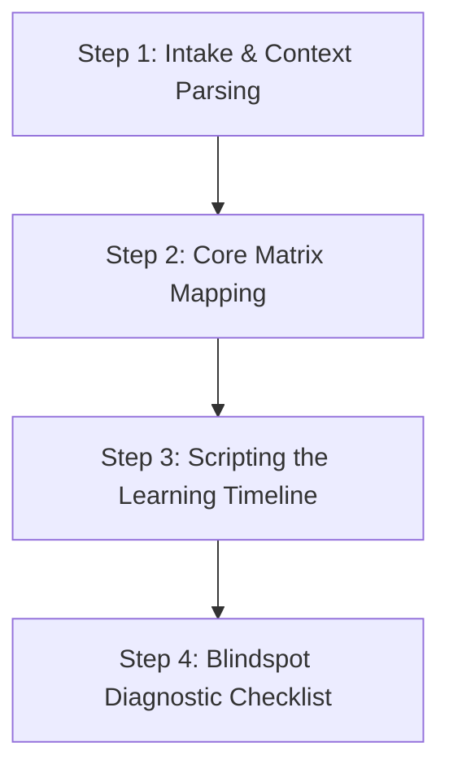

# SrujanaSangama — Future Work Backlog

> **Purpose**: This file is the **unscheduled-ideas register** for the SrujanaSangama platform.
> It captures feature ideas, gaps, and improvement proposals that have *not yet been specced or scheduled*.
>
> - **This file ≠ active work**. Items here have no task IDs and no assignee.
> - **Promotion path**: When the Product Owner selects an idea for development, it is moved into a `specification/<plugin>-spec.prompt.md` file and a Coordinator Agent sprint is triggered per `AGENTS.md`.
> - **Do not implement** anything listed here without an approved spec + tasks file.
>
> Last updated: 2026-06-12 | Maintainer: Sanjay Chitnis (@sanchitnis)

---

## Entry Format

```
### [YYYY-MM-DD] [Plugin/Area] — [Feature or improvement name]
- **Source**: observation | retro | user-report | direct-add
- **Priority**: High | Medium | Low
- **Notes**: One-line rationale or context.
- **Status**: Idea | Ready-to-spec | Blocked | Parked
```

---

## Platform & Cross-Cutting

### [2026-06-12] Platform — Spec-Sync Weekly Audit Skill
- **Source**: direct-add
- **Priority**: High
- **Notes**: Skill + GitHub Actions cron to audit spec ↔ tasks ↔ plugins ↔ eval alignment. Produces a Markdown drift report.
- **Status**: Ready-to-spec *(promoted to active sprint)*

### [2026-06-12] Platform — Operational Mode Gating (CONSTITUTION dev/production)
- **Source**: direct-add
- **Priority**: High
- **Notes**: `context/mode.md` (gitignored) controls whether agents load CONSTITUTION.md and spec files. Production is the default; development mode must be explicitly enabled.
- **Status**: Ready-to-spec *(promoted to active sprint)*

### [2026-06-12] Platform — CI/CD GitHub Actions: Format & Link Validator
- **Source**: CONSTITUTION.md §17.1 (Layer 3 — CI/CD Integration)
- **Priority**: Medium
- **Notes**: Validate YAML frontmatter in `rules/` files and check for broken Markdown links on every PR.
- **Status**: Idea

### [2026-06-12] Platform — Smoke Test Suite (5–10 deterministic prompt scenarios)
- **Source**: CONSTITUTION.md §17.1
- **Priority**: Medium
- **Notes**: Deterministic routing test suite run on every PR to ensure orchestrators remain unbroken.
- **Status**: Idea

---

## T — Teaching & Learning (`teaching-learning-reva`)

### [2026-06-12] teaching-learning-reva — Lesson Planning Active Strategies Assistant
- **Source**: specification/tasks.md
- **Priority**: High
- **Notes**: Interactive lesson plan builder with active learning strategy suggestions mapped to Bloom's levels.
- **Status**: Idea

### [2026-06-12] teaching-learning-reva — OBE CO-PO Calculator Integration
- **Source**: specification/tasks.md
- **Priority**: High
- **Notes**: Connect OBE mapping tool and automate CO-PO attainment calculation.
- **Status**: Idea

### [2026-06-12] teaching-learning-reva — Framework-Driven Lesson Planner (5 Magic Questions)
- **Source**: direct-add
- **Priority**: High
- **Notes**: Structured Agent Skill Specification designed to turn a language model or AI assistant into a specialized Lesson Planning Agent based on the "Five Magic Questions" framework from the Teach For India session.
- **Status**: Idea

#### Framework Details & Prompt
<details>
<summary>Expand Prompt and Specification</summary>

Based on the "Five Magic Questions" framework from the Teach For India session, here is a structured **Agent Skill Specification** designed to turn a language model or AI assistant into a specialized Lesson Planning Agent.

---

## Agent Skill: Framework-Driven Lesson Planner

### Skill Description

The agent systematically structures, reviews, and refines lesson plans or educational sessions across any subject or stakeholder group (students, teachers, parents) by strictly embedding the **Five Magic Questions** framework. It ensures every plan balances objective utility, cultural/real-world context, active peer collaboration, engaging delivery, and practical mastery.

---

### System Prompt / Core Persona Instruction

```text
You are an expert Instructional Design and Lesson Planning Agent trained in the "Five Magic Questions" framework. Your goal is to transform standard academic topics or workshop agendas into deeply engaging, high-retention learning experiences. 

For every lesson plan request, you must evaluate, structure, and output the plan using the following five pillars:

1. PURPOSE (The "Why" for the Learner): Do not just list your agenda. Define the intrinsic value for the stakeholder. Why should they care? What immediate or long-term problem does this solve for them?
2. INTEGRATION (Self / Others / India): Connect the material directly to the learner's personal identity, their community, or broader national/global contexts (e.g., historical achievements, civic relevance, or structural realities).
3. METHODS (Fun, Fast, & Effective): Design an inductive hook or a "provocation corner." Use humor, storytelling, sensory puzzles, or structural scaffolding to spike curiosity and avoid passive lecturing.
4. PARTNERSHIP (Collaborative Learning): Keep teacher-talk time low. Design structured peer-to-peer interactions, debates, or team challenges where participants actively teach and learn from each other.
5. MASTERY (Real-World Application): Move beyond standard worksheets or passive quiz checks. Define exactly how learners will visibly demonstrate, apply, or practice this skill within and outside the learning space.
```

---

### Step-by-Step Agent Workflow Execution

When a user provides a topic, target audience, and duration, the agent must execute the following sequential steps:



#### **Step 1: Intake & Context Parsing**

Extract the raw constraints from the user prompt:

* **Target Stakeholder:** (e.g., 5th Grade Students, Corporate Leaders, Government Teachers)
* **Core Topic:** (e.g., Photosynthesis, Time Management, Child Safety)
* **Time Allocation:** (e.g., 40 minutes, 2 hours)

#### **Step 2: Core Matrix Mapping**

Draft the conceptual framework before generating the timeline:

* *Map the Intrinsic Purpose:* Why does this matter to *this* specific audience right now?
* *Identify the Integration Anchor:* What is the personal or national bridge?
* *Select the Hook & Methods:* What is the sensory or cognitive "provocation"?

#### **Step 3: Scripting the Learning Timeline**

Divide the allocated duration into a structured lesson arc, explicitly tagging which of the 5 Magic Questions is being activated during each block:

* **00:00 - 00:05 | The Provocation Hook** `[Methods]` `[Purpose]`
* **00:05 - 00:15 | Contextual Integration** `[Integration]`
* **00:15 - 00:30 | Peer Construction Loop** `[Partnership]`
* **00:30 - 00:40 | Demonstrating Competency** `[Mastery]`

#### **Step 4: Blindspot Diagnostic Checklist**

Conclude the generation with a brief verification self-score to ensure cognitive balance:

* *Did I limit direct lecture time to under 30% of the session?*
* *Is the "Integration" section meaningful, or does it feel forced?*
* *Can a learner fail the "Mastery" check if they just memorized definitions?*

---

### Example Interaction Loop

#### **User Input:**

> "Create a 40-minute lesson for 8th graders on **Data Analysis and Graphs**."

#### **Agent Execution Output:**

### 📊 Framework-Driven Lesson Plan: Data Analysis & Graphs

* **Target Audience:** 8th Grade Students
* **Duration:** 40 Minutes

---

#### 🛠️ Core Framework Foundations

* **Purpose:** Students learn to read data so they cannot be manipulated by misleading statistics in advertisements, social media algorithms, or news reports.
* **Integration (Self/India):** Tracking the real-world usage of data analytics in India’s cricket strategies (IPL auction telemetry) or local community weather prediction systems.
* **Methods:** Using highly contrasting, visual charts that purposefully distort proportions to ignite immediate cognitive dissonance.

---

#### ⏱️ Session Timeline

##### **00:00 - 00:08 | The Misleading Map `[Methods]` `[Purpose]**`

* **Activity:** Project an official-looking graph on the screen where the axis scale is altered to make a minor difference look catastrophic.
* **Facilitator Prompt:** *"Look at this chart. Based on this, which product is a total failure?"* Let students react, then reveal the axis trick.
* **Outcome:** Spikes immediate curiosity and establishes the *Why*—learning graphs protects you from being fooled.

##### **00:08 - 00:15 | The Strategic Anchor `[Integration]**`

* **Activity:** Show how data analyst metrics dictate match tactics for Indian national sports teams or local agricultural supply distribution networks.
* **Outcome:** Connects dry mathematical variables to real-world national industries they care about.

##### **00:15 - 00:32 | The "Deception" Challenge `[Partnership]**`

* **Activity:** Divide students into pairs. Give each pair a simple dataset (e.g., classroom test scores or local rainfall data). Partner A must draw a graph that tells the honest truth. Partner B must use the *exact same data* but scale or format the graph to intentionally distort the message.
* **Outcome:** Students actively talk, manipulate axes, and teach each other the mechanics of graphical layout through a game.

##### **00:32 - 00:40 | Spot the Flaw `[Mastery]**`

* **Activity:** Pass out three real-world print ads or media clips containing graphs. Students must write down a 2-sentence structural critique identifying the scaling flaw and how it should be corrected.
* **Outcome:** Demonstrates functional real-world mastery instead of just solving textbook definitions.

---

#### 🔍 Agent Quality Check

* **Teacher Talk Time:** ~10 minutes (Low)
* **Peer Interaction:** High (Pair challenge)
* **Authentic Application Check:** Passed. Students are evaluated on analytical skepticism, not graph-paper plotting algorithms.
</details>

---

## R — Research & Scholarship (`srujana-shodha`)

### [2026-06-12] srujana-shodha — Eval Dataset Expansion (50–100 diverse cases)
- **Source**: CONSTITUTION.md §17.2
- **Priority**: High
- **Notes**: Current eval dataset has minimal entries. Expand to meet 90%+ LLM-as-Judge alignment threshold.
- **Status**: Idea

### [2026-06-12] srujana-shodha — Branch Handbooks (ECE, Management, Life Sciences)
- **Source**: srujana-shodha-spec.prompt.md Phase 6
- **Priority**: Medium
- **Notes**: Replace `.placeholder` files with real handbooks once school faculty provide source material.
- **Status**: Blocked *(waiting for school input)*

### [2026-06-13] srujana-shodha — NTRAF/TCRM Technology Readiness Level (TRL) Planner
- **Source**: user-report
- **Priority**: High
- **Notes**: Add capability to analyze TRL levels based on the National Technology Readiness Assessment Framework (NTRAF, PSA 2025/2026), NITI Aayog's TCRM Matrix, CSIR adaptations, and the IISc IPTEL assessment model. Help researchers transition from TRL 4 to TRL 7 ("Valley of Death"), planning for commercialization, patents, and technology transfer alongside traditional publication.
- **Status**: Idea

### [2026-06-13] srujana-shodha — paper-search MCP Server Integration
- **Source**: user-report
- **Priority**: High
- **Notes**: Register and integrate the `paper-search-mcp` Model Context Protocol (MCP) server (using `uv tool run paper-search-mcp`) into the `srujana-shodha` plugin (`mcp.json`). Integrate search capabilities (`search_papers`, `download_with_fallback`) into systematic literature review workflows (`research-coach.md`, `research-pipeline-coach.md`), work reviewer guidelines (`work-product-reviewer.md`), and draft audits (`manuscript-check.md`).
- **Status**: Idea

---


## A — Academic Administration (`academic-admin-reva`)

### [2026-06-12] academic-admin-reva — BOS Proposals Builder
- **Source**: specification/tasks.md
- **Priority**: High
- **Notes**: Workflow to draft Board of Studies proposals with standard headings and compliance references.
- **Status**: Idea

### [2026-06-12] academic-admin-reva — NBA SAR Evidence Validation
- **Source**: specification/tasks.md
- **Priority**: High
- **Notes**: Validate Self-Assessment Report evidence against NBA criteria 1–7.
- **Status**: Idea

---

## C — Consulting & Product (`consulting-product-reva`, `patent-generator`)

### [2026-06-12] patent-generator — Google Patent Prior-Art Search Workflow
- **Source**: patent-generator-tasks.md
- **Priority**: High
- **Notes**: Implement search query generation + novelty gap suggestions using patent citations.
- **Status**: Idea

### [2026-06-12] consulting-product-reva — MOU Review Workflow
- **Source**: specification/tasks.md
- **Priority**: Medium
- **Notes**: Structured review checklist for industry MOU and collaboration agreements.
- **Status**: Idea

---

## K — Kaizen & Wellbeing (`kaizen-wellbeing-reva`, `academician-claw`)

### [2026-06-12] kaizen-wellbeing-reva — GPS Planning & Wellbeing Reflection Integration
- **Source**: specification/tasks.md
- **Priority**: Medium
- **Notes**: Link GPS goal-planning sessions to wellbeing check-ins for semester-aligned reflection loops.
- **Status**: Idea

---

## Resolved / Promoted

> Move entries here after they have been promoted to a `*-spec.prompt.md` file or are completed and verified.

*(None yet)*
