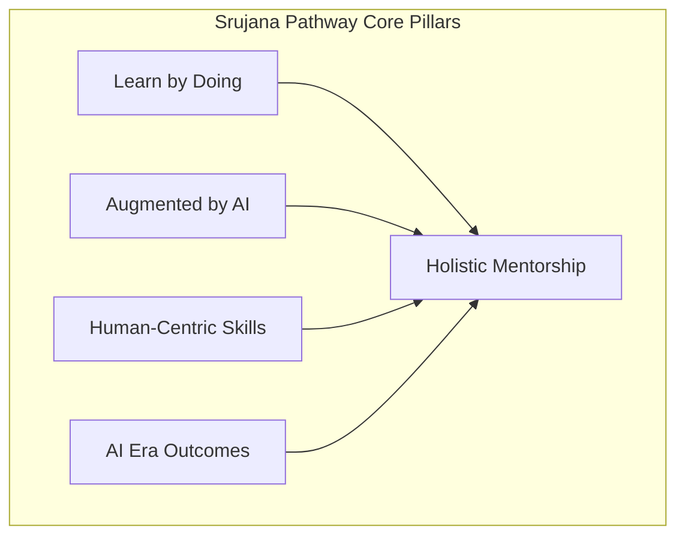

# Srujana Pathway: Mentoring Philosophy and Stages

The **Srujana Pathway** outlines a comprehensive framework for mentoring students and faculty across four developmental stages. This pathway integrates academic learning, industry interaction, and entrepreneurial execution. The entire journey is underpinned by four core philosophy principles designed to prepare participants for success in the AI era.

---

## The Four Developmental Stages

The Srujana Pathway is designed to be highly flexible, allowing students and faculty to complete one, two, three, or all four stages based on their individual interests, career aspirations, and capabilities.

### 1. Curriculum, Clubs, and Self-Learning
* **Focus**: Foundational Knowledge, Skills, and Attitude/Ability.
* **Mechanism**: Delivered through an enhanced, flexible curriculum, active participation in club activities, and self-paced learning.
* **Mentoring Approach**: Mentors guide learners in acquiring core technical competencies and developing the right academic mindset. Learning is self-directed but structured.

### 2. Internships
* **Focus**: Practical Exposure and Real-World Application.
* **Mechanism**: Industry-mentored projects.
* **Mentoring Approach**: Mentors connect learners with industry partners and guide them through applying academic theories to address practical business problems. Emphasis is placed on professional workflows and accountability.

### 3. Product, Solution Development, Consulting, or Research
* **Focus**: Deep inquiry and value creation.
* **Mechanism**: Designing tangible products, providing consulting services, or conducting academic and applied research.
* **Mentoring Approach**: Mentors work alongside participants as research advisors or project directors, driving the transition from passive learning to active creation, problem-solving, and intellectual property generation.

### 4. Enterprising Students, AI Era Careers, and Startups
* **Focus**: Commercialization, elite career placement, and enterprise creation.
* **Mechanism**: Securing marquee AI-era careers, executing consulting contracts, or launching startup ventures.
* **Mentoring Approach**: Mentors act as business advisors, incubator facilitators, and career strategists, steering high-capability participants toward institutional scale, investment readiness, or elite industry roles.

---

## The Underlying Mentoring Philosophy

The four core philosophy pillars at the bottom of the framework span all four developmental stages, guiding the interaction between mentors, students, and faculty.

### I. Learn by Doing
Mentoring is experiential. Instead of passive lecturing, mentors facilitate active execution. At every stage—whether joining a student club or launching a startup—participants learn by building, testing, failing, and iterating. Mentors provide immediate feedback on active projects rather than conducting theoretical assessments.

### II. Augmented by AI
Mentors train and encourage participants to utilize AI tools as strategic force-multipliers. Rather than bypassing intellectual effort, AI is integrated to accelerate research, automate repetitive coding or writing tasks, and enhance productivity. Mentors teach participants how to write effective prompts, critically evaluate AI outputs, and maintain academic integrity while leveraging advanced digital tools.

### III. With Human-Centric Skills
As technical tasks become increasingly automated by AI, mentoring places a premium on unique human capabilities. Mentors foster critical thinking, ethics, emotional intelligence, leadership, collaboration, and communication. This ensures that the products and solutions developed are ethical, user-focused, and socially responsible.

### IV. Resulting in AI Era Careers, Products/Portfolio, and Branding
The ultimate goal of the Srujana Pathway mentoring model is tangible impact. Mentors guide participants to focus on output metrics:
* **AI Era Careers**: Securing high-value, future-proof employment.
* **Products & Portfolios**: Compiling a documented portfolio of functional code, published papers, or filed patents.
* **Branding**: Establishing professional credibility and institutional recognition for both the individual and the university.
